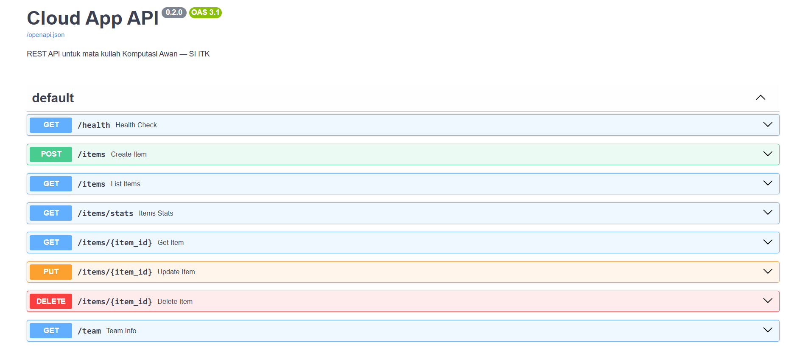

# ☁️ Cloud App - SafeSpace

## 📌 Deskripsi Proyek
SafeSpace adalah aplikasi manajemen bimbingan konseling berbasis cloud yang dirancang untuk memfasilitasi siswa dalam mengajukan layanan konseling secara aman, privat, dan fleksibel. 

Melalui aplikasi ini, siswa dapat mengisi formulir pengajuan konseling, memilih guru BK yang diinginkan, serta berkomunikasi langsung melalui fitur chat. Sistem memastikan bahwa hanya guru BK yang dipilih yang dapat mengakses data dan riwayat konseling siswa, sehingga menjaga kerahasiaan informasi. 

Di sisi guru BK, tersedia dashboard untuk melihat daftar pengajuan, menerima atau menolak permintaan konseling, mengakses kontak siswa jika diperlukan, serta mencatat perkembangan hasil bimbingan. Urgensi pengembangan SafeSpace didasarkan pada kebutuhan akan layanan konseling yang lebih mudah diakses, menjaga privasi siswa, serta mendukung proses pendampingan yang terdokumentasi dan terkelola secara digital melalui teknologi cloud computing.

## 🎯 Tujuan Pengembangan
* Menyediakan platform konseling digital yang aman dan mudah diakses.
* Menjaga kerahasiaan data siswa melalui sistem otorisasi berbasis peran.
* Mendukung proses monitoring dan dokumentasi bimbingan secara terpusat.
* Mengimplementasikan konsep cloud computing pada aplikasi nyata.

## 👥 Tim

| Nama | NIM | Peran |
|------|-----|-------|
| Rendy Rifandi Kurnia | 10231081 | Lead Backend |
| Riska Fadlun Khairiyah Purba | 10231083 | Lead Frontend |
| Rizki Abdul Aziz | 10231085 | Lead DevOps |
| Siti Nur Azizah Putri Awni | 10231087 | Lead QA & Docs |

## 🛠️ Tech Stack

Berdasarkan struktur proyek di `backend/` dan `frontend/`:

### Backend (`backend/`)
| Teknologi | Fungsi |
|-----------|--------|
| FastAPI | REST API & web framework |
| Uvicorn | ASGI server |
| Azure AI Document Intelligence | OCR & ekstraksi dokumen |
| LangChain & OpenAI | AI review & orkestrasi LLM |
| PyMuPDF, pdf2image, Pillow | Pemrosesan PDF & gambar |
| Pydantic | Validasi data & schema |
| SQLAlchemy | ORM & akses database |
| python-dotenv | Konfigurasi environment |
| Pytest | Testing |

### Frontend (`frontend/`)

### Infrastruktur & DevOps
| Teknologi | Fungsi |
|-----------|--------|
| Docker | Containerization |
| GitHub Actions | CI/CD |
| Railway/Render | Cloud deployment |


## 🏗️ Architecture

```
[React Frontend] <--HTTP--> [FastAPI Backend] <--SQL--> [PostgreSQL]
```

*(Diagram ini akan berkembang setiap minggu)*

## 🚀 Getting Started

### Prasyarat
- Python 3.10+
- Node.js 18+
- Git

### Backend
```bash
cd backend
pip install -r requirements.txt
uvicorn main:app --reload --port 8000
```
API: http://localhost:8000 — Docs: http://localhost:8000/docs

### Frontend
```bash
cd frontend
npm install
npm run dev
```
## 📡 API Endpoints

Base URL: http://localhost:8000  
Swagger Documentation: http://localhost:8000/docs

| Method | Endpoint | Deskripsi | Request Body | Response |
|---|---|---|---|---|
| GET | `/items` | Mengambil daftar seluruh item (mendukung pagination & search) | - | List item + total data |
| POST | `/items` | Menambahkan item baru | name, description, price, quantity | Data item yang dibuat |
| GET | `/items/{id}` | Mengambil detail item berdasarkan ID | - | Detail item |
| PUT | `/items/{id}` | Memperbarui data item berdasarkan ID | field yang ingin diupdate | Data item terbaru |
| DELETE | `/items/{id}` | Menghapus item berdasarkan ID | - | 204 No Content |
| GET | `/items/stats` | Menampilkan statistik inventory | - | Statistik inventory |

## 📅 Roadmap

| Minggu | Target | Status |
|--------|--------|--------|
| 1 | Setup & Hello World | ✅ |
| 2 | REST API + Database | ✅ |
| 3 | React Frontend | ⬜ |
| 4 | Full-Stack Integration | ⬜ |
| 5-7 | Docker & Compose | ⬜ |
| 8 | UTS Demo | ⬜ |
| 9-11 | CI/CD Pipeline | ⬜ |
| 12-14 | Microservices | ⬜ |
| 15-16 | Final & UAS | ⬜ |

## 📁 Project Structure

```
cc-kelompok-a-suksesss/
├── backend/                    # FastAPI Backend
│   ├── main.py                 # Entry point, FastAPI app
│   ├── database.py             # Koneksi database
│   ├── models.py               # SQLAlchemy models (tabel database)
│   ├── schemas.py              # Pydantic schemas (validasi request/response)
│   ├── crud.py                 # Fungsi CRUD (business logic)
│   ├── requirements.txt        # Dependencies
│   └── .env                    # Environment variables
│
├── frontend/                   # React Frontend (Vite)
│   ├── public/                 # Aset statis publik
│   ├── src/                    # Source code utama
│   ├── index.html              # Template HTML utama
│   ├── package.json            # Dependensi & scripts Node.js
│   ├── vite.config.js          # Konfigurasi Vite
│   └── eslint.config.js        # Konfigurasi ESLint
│
├── docs/                       # Dokumentasi tim
│   ├── member-Azizah.md
│   ├── member-Rendy.md
│   ├── member-Riska.md
│   └── member-Rizki.md
│
├── .gitignore
└── README.md
```
---

### Hasil
