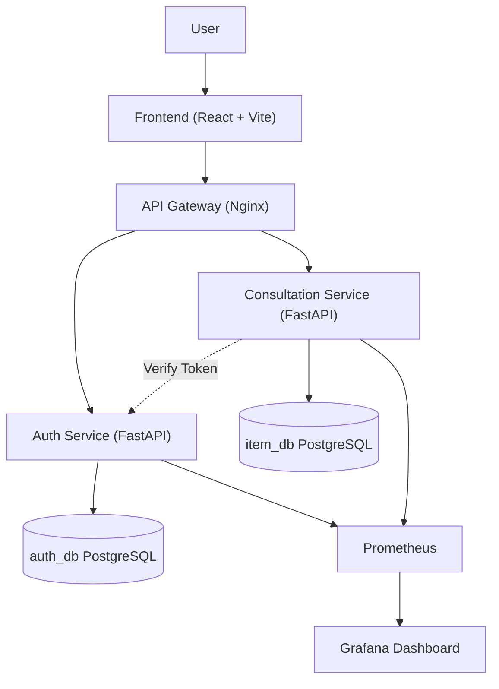

# ☁️ SafeSpace Cloud Application


> Aplikasi cloud-native berbasis **microservices** untuk layanan konsultasi dan manajemen data bimbingan konseling yang dikembangkan sebagai proyek mata kuliah **Komputasi Awan – Institut Teknologi Kalimantan (ITK)**.
---

# Table of Contents

1. [Project Overview](#project-overview)
2. [Deployment](#deployment)
3. [Architecture](#architecture)
4. [Architecture Evolution](#architecture-evolution)
5. [Technology Stack](#technology-stack)
6. [Repository Structure](#repository-structure)
7. [Quick Start](#-quick-start)
8. [Running Without Docker](#-running-without-docker)
9. [API Documentation](#-api-documentation)
10. [Monitoring & Observability](#-monitoring--observability)
11. [Security](#-security)
12. [CI/CD Pipeline](#-cicd-pipeline)
13. [Environment Variables](#️-environment-variables)
14. [Project Documentation](#-project-documentation)
15. [Development Roadmap](#development-roadmap)
16. [Team Members](#team-members)

---

# Project Overview

SafeSpace merupakan aplikasi berbasis web yang digunakan untuk membantu proses konsultasi antara siswa dan Guru Bimbingan Konseling (BK). Sistem dikembangkan menggunakan arsitektur **cloud-native microservices** dengan pemisahan service autentikasi dan service konsultasi sehingga lebih mudah dikembangkan, dipelihara, dan di-deploy.

Project ini juga mengimplementasikan konsep:

* REST API
* JWT Authentication
* Docker Containerization
* Docker Compose
* API Gateway
* Microservices Architecture
* Monitoring menggunakan Prometheus dan Grafana
* CI Pipeline menggunakan GitHub Actions

---

# Deployment

SafeSpace telah di-deploy pada platform cloud sehingga aplikasi dapat diakses secara online tanpa perlu melakukan instalasi atau konfigurasi lokal.

### Deployment URLs

| Service | URL |
|----------|-----|
| Frontend | https://safespace-itk.onrender.com |
| Backend API | https://safespace-db.onrender.com |
| Swagger API Docs | https://safespace-db.onrender.com/docs |

### Deployment Infrastructure

Implementasi deployment menggunakan beberapa komponen cloud sebagai berikut:

- **Render** sebagai platform cloud deployment
- **Docker** untuk containerization aplikasi
- **PostgreSQL** sebagai database service
- **GitHub Actions** untuk proses Continuous Integration (CI)

Aplikasi yang diakses melalui URL di atas merupakan versi deployment yang digunakan untuk demonstrasi dan pengujian sistem pada lingkungan cloud.

---

# Architecture


```mermaid
flowchart TD

USER["User"]

USER --> FE["Frontend (React + Vite)"]

FE --> GW["API Gateway (Nginx)"]

GW --> AUTH["Auth Service (FastAPI)"]
GW --> ITEM["Consultation Service (FastAPI)"]

AUTH --> AUTHDB[("auth_db PostgreSQL")]
ITEM --> ITEMDB[("item_db PostgreSQL")]

ITEM -. Verify Token .-> AUTH

AUTH --> PROM["Prometheus"]
ITEM --> PROM

PROM --> GRAF["Grafana Dashboard"]
```

---

# Architecture Evolution

| Phase            | Weeks      | Architecture                                     |
| ---------------- | ---------- | ------------------------------------------------ |
| Foundation       | Week 1-4   | Monolithic Fullstack Application                 |
| Containerization | Week 5-7   | Docker Compose                                   |
| CI/CD            | Week 9-11  | GitHub Actions Pipeline                          |
| Microservices    | Week 12-14 | Auth Service + Consultation Service + Gateway    |
| Final            | Week 15-16 | Monitoring, Security Hardening, Production Ready |

---

# Technology Stack

| Layer             | Technology     | Purpose                     |
| ----------------- | -------------- | --------------------------- |
| Frontend          | React 18       | User Interface              |
| Frontend Build    | Vite           | Frontend Development Server |
| Backend Framework | FastAPI        | REST API Development        |
| Language          | Python 3.12    | Backend Programming         |
| Database          | PostgreSQL 16  | Data Storage                |
| ORM               | SQLAlchemy     | Database ORM                |
| Validation        | Pydantic       | Request Validation          |
| Authentication    | JWT + OAuth2   | User Authentication         |
| Password Security | bcrypt         | Password Hashing            |
| Gateway           | Nginx          | Reverse Proxy               |
| Containerization  | Docker         | Service Isolation           |
| Orchestration     | Docker Compose | Multi-container Deployment  |
| Monitoring        | Prometheus     | Metrics Collection          |
| Dashboard         | Grafana        | Visualization Dashboard     |
| Cloud             | Render         | PaaS Deployment             |
| CI                | GitHub Actions | Continuous Integration      |
| Environment       | dotenv         | Environment Configuration   |

---

# Repository Structure
```text
CC-KELOMPOK-A-SUKSESSS/
│
├── .github/                             # ⚙️ GitHub configuration
│   └── workflows/                       # CI/CD GitHub Actions
│
├── backend/                             # 🧠 Backend utama (FastAPI Monolith)
│   │
│   ├── middleware/                      # Middleware aplikasi
│   ├── routers/                         # Endpoint API modular
│   ├── scripts/                         # Database seeding & helper scripts
│   ├── tests/                           # Unit & integration testing
│   ├── utils/                           # Utility functions
│   │
│   ├── auth.py                          # JWT Authentication
│   ├── config.py                        # Konfigurasi aplikasi
│   ├── crud.py                          # Business logic & database operation
│   ├── database.py                      # Database connection
│   ├── main.py                          # FastAPI entry point
│   ├── models.py                        # SQLAlchemy database models
│   ├── schemas.py                       # Pydantic schemas
│   │
│   ├── .env.example                     # Template environment variables
│   ├── .env.development                 # Development configuration
│   ├── .env.production                  # Production configuration
│   ├── .env.docker                      # Docker configuration
│   ├── Dockerfile                       # Backend container image
│   └── requirements.txt                 # Python dependencies
│
├── frontend/                            # 🎨 Frontend Application (React + Vite)
│   │
│   ├── public/                          # Public assets
│   ├── src/                             # Source code React
│   │   ├── assets/                      # Images & static resources
│   │   ├── components/                  # Reusable UI components
│   │   ├── pages/                       # Application pages
│   │   ├── services/                    # API communication layer
│   │   └── utils/                       # Frontend helper functions
│   │
│   ├── .env.example                     # Frontend environment template
│   ├── .env.production                  # Production configuration
│   ├── Dockerfile                       # Production container image
│   ├── Dockerfile.dev                   # Development container image
│   ├── nginx.conf                       # Nginx configuration
│   ├── package.json                     # Dependencies & scripts
│   └── vite.config.js                   # Vite configuration
│
├── services/                            # ☁️ Microservices Implementation
│   │
│   ├── auth-service/                    # Authentication Service
│   ├── item-service/                    # Consultation Service
│   └── gateway/                         # API Gateway (Nginx)
│
├── monitoring/                          # 📊 Observability Configuration
│   └── prometheus.yml                   # Prometheus configuration
│
├── docs/                                # 📚 Project Documentation
│   ├── architecture.md                  # System architecture
│   ├── deployment-guide.md              # Deployment guide
│   ├── operations-guide.md              # Operations guide
│   ├── api-contract.md                  # API contract documentation
│   ├── database-schema.md               # Database schema
│   ├── docker-architecture.md           # Docker architecture
│   ├── blackbox-testing.md              # Blackbox testing report
│   ├── swagger-testing.md               # Swagger API testing report
│   └── release-notes-m3.md              # Release notes
│
├── scripts/                             # 🔧 Automation scripts
│
├── docker-compose.yml                   # Local deployment
├── docker-compose.dev.yml               # Development deployment
├── docker-compose.microservices.yml     # Microservices deployment
├── docker-compose.prod.yml              # Production deployment
│
├── Makefile                             # Automation commands
├── project_brief.md                     # Project requirements
├── CODEOWNERS                           # Repository ownership
├── README.md                            # Main documentation
└── .gitignore                           # Git ignore rules
```

### Struktur Utama

| Folder/File           | Deskripsi                                                                                                    |
| --------------------- | ------------------------------------------------------------------------------------------------------------ |
| `backend/`            | Backend utama berbasis FastAPI yang menangani business logic, autentikasi, database, dan API.                |
| `frontend/`           | Frontend aplikasi menggunakan React dan Vite.                                                                |
| `services/`           | Implementasi arsitektur microservices yang terdiri dari Auth Service, Consultation Service, dan API Gateway. |
| `monitoring/`         | Konfigurasi monitoring menggunakan Prometheus.                                                               |
| `docs/`               | Seluruh dokumentasi proyek, deployment, testing, dan arsitektur sistem.                                      |
| `scripts/`            | Script otomatisasi dan helper project.                                                                       |
| `docker-compose*.yml` | Konfigurasi deployment untuk berbagai environment.                                                           |
| `Makefile`            | Kumpulan perintah otomatis untuk development dan deployment.                                                 |
| `README.md`           | Dokumentasi utama proyek.                                                                                    |

---

# 🚀 Quick Start

Bagian ini menjelaskan cara menjalankan SafeSpace menggunakan Docker Compose. Metode ini direkomendasikan karena seluruh service, database, monitoring, dan API Gateway akan dijalankan secara otomatis dalam satu perintah.

## 📋 Prerequisites

Pastikan perangkat telah terpasang:

* Docker
* Docker Compose
* Git

---

## 1️⃣ Clone Repository

Unduh source code proyek:

```bash
git clone https://github.com/[organization]/[repository].git
cd SafeSpace
```

---

## 2️⃣ Configure Environment

Buat file environment dari template yang telah disediakan:

```bash
cp .env.example .env
```

Kemudian sesuaikan konfigurasi pada file `.env` apabila diperlukan.

---

## 3️⃣ Start All Services

Jalankan seluruh service menggunakan Docker Compose:

```bash
docker compose -f docker-compose.microservices.yml up -d --build
```

Perintah tersebut akan menjalankan:

| Service                    | Description                     |
| -------------------------- | ------------------------------- |
| API Gateway                | Reverse proxy menggunakan Nginx |
| Auth Service               | Layanan autentikasi dan JWT     |
| Consultation Service       | Layanan konsultasi siswa        |
| PostgreSQL Auth DB         | Database autentikasi            |
| PostgreSQL Consultation DB | Database konsultasi             |
| Prometheus                 | Metrics collector               |
| Grafana                    | Monitoring dashboard            |

---

## 4️⃣ Verify Deployment

Pastikan seluruh container berjalan:

```bash
docker compose ps
```

Lakukan pengecekan health endpoint:

```bash
curl http://localhost:8080/health
```

Jika service berjalan dengan baik, endpoint akan mengembalikan status **healthy**.

---

## 5️⃣ Access Application

### 🌐 Application URLs

| Service              | URL                           |
| -------------------- | ----------------------------- |
| Frontend Application | http://localhost:8080         |
| Grafana Dashboard    | http://localhost:3002         |
| Prometheus Dashboard | http://localhost:9090         |
| Prometheus Targets   | http://localhost:9090/targets |

### 📊 Grafana Login

| Username | Password |
| -------- | -------- |
| admin    | admin    |

---

# 💻 Running Without Docker

Untuk kebutuhan development, setiap komponen dapat dijalankan secara terpisah tanpa Docker.

## Backend Service

Install dependency dan jalankan FastAPI:

```bash
cd backend
pip install -r requirements.txt
uvicorn main:app --reload
```

Backend akan berjalan pada environment development dengan fitur auto-reload.

---

## Frontend Service

Install dependency dan jalankan React Development Server:

```bash
cd frontend
npm install
npm run dev
```
Frontend akan dijalankan menggunakan Vite Development Server.

---
# 📡 API Documentation

SafeSpace menyediakan REST API yang digunakan oleh frontend dan service internal untuk mendukung proses autentikasi, pengelolaan konsultasi, dashboard monitoring, serta layanan publik.

Dokumentasi API lengkap juga dapat diakses melalui Swagger UI setelah aplikasi dijalankan:

```text
http://localhost:8080/docs
```

Endpoint dikelompokkan berdasarkan fungsi utama untuk memudahkan proses pengembangan dan integrasi.

---

## 🔐 Authentication API

Authentication API digunakan untuk proses registrasi, login, validasi token, dan pengambilan informasi pengguna yang sedang aktif.

| Method | Endpoint                    | Description                      | Auth |
| ------ | --------------------------- | -------------------------------- | ---- |
| POST   | `/auth/counselors/register` | Register akun Guru BK            | ❌    |
| POST   | `/auth/counselor/login`     | Login Guru BK                    | ❌    |
| POST   | `/auth/counselor/token`     | Generate JWT Token               | ❌    |
| GET    | `/auth/me`                  | Informasi user yang sedang login | ✅    |
| GET    | `/auth/counselor/me`        | Informasi Guru BK aktif          | ✅    |

---

## 📝 Consultation API

Consultation API digunakan untuk mengelola seluruh proses konsultasi antara siswa dan Guru BK.

| Method | Endpoint                            | Description                | Auth |
| ------ | ----------------------------------- | -------------------------- | ---- |
| POST   | `/api/consultations`                | Membuat konsultasi baru    | ❌    |
| GET    | `/api/bk/consultations`             | Melihat seluruh konsultasi | ✅    |
| GET    | `/api/bk/consultations/{id}`        | Detail konsultasi          | ✅    |
| PATCH  | `/api/bk/consultations/{id}/accept` | Menerima konsultasi        | ✅    |
| PATCH  | `/api/bk/consultations/{id}/reject` | Menolak konsultasi         | ✅    |
| DELETE | `/api/bk/consultations/{id}`        | Menghapus konsultasi       | ✅    |

---

## 📊 Dashboard API

Dashboard API digunakan untuk menampilkan ringkasan statistik konsultasi yang akan ditampilkan pada dashboard Guru BK.

| Method | Endpoint                  | Description                    | Auth |
| ------ | ------------------------- | ------------------------------ | ---- |
| GET    | `/api/bk/dashboard/stats` | Statistik dashboard konsultasi | ✅    |

---

## 🌐 Public API

Public API dapat diakses tanpa autentikasi dan digunakan oleh frontend untuk menampilkan data yang bersifat publik.

| Method | Endpoint                  | Description                    | Auth |
| ------ | ------------------------- | ------------------------------ | ---- |
| GET    | `/api/public/master-data` | Mengambil data master aplikasi | ❌    |
| GET    | `/api/public/counselors`  | Daftar Guru BK yang tersedia   | ❌    |

---

## 📈 Monitoring API

Monitoring API digunakan untuk memantau kondisi aplikasi dan membantu proses observability selama development maupun deployment.

| Method | Endpoint                 | Description                            |
| ------ | ------------------------ | -------------------------------------- |
| GET    | `/health`                | Status kesehatan aplikasi              |
| GET    | `/monitoring/health`     | Informasi kesehatan monitoring service |
| GET    | `/monitoring/error-rate` | Statistik tingkat error aplikasi       |
| GET    | `/team`                  | Informasi tim pengembang               |

---

## 🔑 Authentication Legend

| Symbol | Description                              |
| ------ | ---------------------------------------- |
| ✅      | Endpoint memerlukan JWT Authentication   |
| ❌      | Endpoint dapat diakses tanpa autentikasi |

---

# 📊 Monitoring & Observability

SafeSpace menerapkan mekanisme monitoring dan observability untuk membantu proses pemantauan performa aplikasi, kesehatan service, serta proses troubleshooting selama pengembangan maupun deployment.

Monitoring dilakukan menggunakan kombinasi **Prometheus** sebagai metrics collector dan **Grafana** sebagai dashboard visualisasi.

### Monitoring Features

* 📈 **Prometheus Metrics** untuk mengumpulkan metrics dari setiap service.
* 📊 **Grafana Dashboard** untuk memvisualisasikan metrics secara real-time.
* ❤️ **Health Check Endpoint** untuk memastikan service berjalan dengan baik.
* ⚠️ **Error Rate Monitoring** untuk memantau tingkat kegagalan request.
* 🐳 **Container Health Check** untuk memonitor status container Docker.
* 📝 **Docker Logging** untuk membantu proses debugging dan troubleshooting.

### Monitoring Services

| Service            | URL                             | Description                                  |
| ------------------ | ------------------------------- | -------------------------------------------- |
| Grafana Dashboard  | `http://localhost:3002`         | Dashboard visualisasi metrics aplikasi       |
| Prometheus         | `http://localhost:9090`         | Metrics collector dan monitoring server      |
| Prometheus Targets | `http://localhost:9090/targets` | Status scraping metrics dari seluruh service |

---

# 🔐 Security

Untuk menjaga keamanan data dan komunikasi antar service, SafeSpace menerapkan beberapa mekanisme keamanan yang umum digunakan pada aplikasi cloud-native.

### Security Features

| Mechanism               | Description                                                            |
| ----------------------- | ---------------------------------------------------------------------- |
| JWT Authentication      | Melindungi endpoint yang memerlukan autentikasi pengguna               |
| OAuth2 Password Flow    | Mendukung proses login dan token generation                            |
| bcrypt Password Hashing | Menyimpan password dalam bentuk hash yang aman                         |
| Environment Variables   | Menyimpan konfigurasi sensitif di luar source code                     |
| CORS Configuration      | Membatasi akses API dari domain yang tidak diizinkan                   |
| Pydantic Validation     | Melakukan validasi request sebelum diproses                            |
| Database Isolation      | Setiap service memiliki database terpisah sesuai prinsip microservices |

---

# 🔄 CI/CD Pipeline

SafeSpace menerapkan **Continuous Integration (CI)** menggunakan GitHub Actions untuk memastikan setiap perubahan kode telah melalui proses validasi sebelum digabungkan ke branch utama.

Pipeline akan berjalan secara otomatis ketika terjadi:

* Push ke branch `main`
* Pull Request menuju branch `main`

### CI Workflow

```text
Developer Push
        │
        ▼
GitHub Actions Trigger
        │
        ▼
Backend Testing (Pytest)
        │
        ▼
Frontend Testing (Vitest)
        │
        ▼
Frontend Build
        │
        ▼
Docker Build Validation
        │
        ▼
Health Check
        │
        ▼
Pipeline Success
```

### Pipeline Objectives

* ✅ Menjaga kualitas source code
* ✅ Memastikan seluruh test berhasil dijalankan
* ✅ Memvalidasi proses build aplikasi
* ✅ Mengurangi risiko deployment error

---

# ⚙️ Environment Variables

SafeSpace menggunakan file `.env` untuk menyimpan konfigurasi aplikasi yang dapat berbeda pada setiap environment.

Untuk membuat file konfigurasi lokal:

```bash
cp .env.example .env
```

Kemudian sesuaikan nilai konfigurasi sesuai kebutuhan.

### Main Configuration

| Variable                    | Description                                |
| --------------------------- | ------------------------------------------ |
| DATABASE_URL                | URL koneksi database PostgreSQL            |
| SECRET_KEY                  | Kunci rahasia untuk JWT Authentication     |
| ACCESS_TOKEN_EXPIRE_MINUTES | Masa berlaku access token                  |
| API_V1_PREFIX               | Prefix endpoint API                        |
| CORS_ORIGINS                | Daftar origin yang diizinkan mengakses API |
| LOG_LEVEL                   | Level logging aplikasi                     |

> Disarankan untuk tidak menyimpan informasi sensitif secara langsung pada source code dan selalu menggunakan environment variables untuk konfigurasi rahasia.
---

# 📚 Project Documentation

Seluruh dokumentasi proyek disimpan pada folder `docs/` untuk memudahkan proses pengembangan, deployment, pengujian, dan pemeliharaan aplikasi.

| Category | Document | Description |
|----------|----------|-------------|
| Architecture | 📄 [Architecture Guide](docs/architecture.md) | Dokumentasi arsitektur sistem dan microservices. |
| Deployment | 🚀 [Deployment Guide](docs/deployment-guide.md) | Panduan deployment aplikasi. |
| API | 🔌 [API Contract](docs/api-contract.md) | Dokumentasi endpoint API. |
| Testing | 🧪 [Blackbox Testing](docs/blackbox-testing.md) | Pengujian fungsional aplikasi. |
| Testing | 🔍 [Swagger API Testing](docs/swagger-testing.md) | Pengujian endpoint API. |
| Database | 🗄️ [Database Schema](docs/database-schema.md) | Struktur dan relasi database. |
| Infrastructure | 🐳 [Docker Architecture](docs/docker-architecture.md) | Dokumentasi container dan network. |
| Operations | ⚙️ [Operations Guide](docs/operations-guide.md) | Panduan operasional aplikasi. |
| Release | 📝 [Release Notes](docs/release-notes-m3.md) | Riwayat perkembangan proyek. |

---

# Development Roadmap

| Week | Target               | Status |
| ---- | -------------------- | ------ |
| 1    | Setup Project        | ✅      |
| 2    | REST API             | ✅      |
| 3    | Frontend Integration | ✅      |
| 4    | Authentication       | ✅      |
| 5    | Docker               | ✅      |
| 6    | Docker Compose       | ✅      |
| 7    | Container Testing    | ✅      |
| 8    | Midterm Demo         | ✅      |
| 9    | GitHub Actions       | ✅      |
| 10   | CI Pipeline          | ✅      |
| 11   | Cloud Deployment     | ✅      |
| 12   | Microservices        | ✅      |
| 13   | API Gateway          | ✅      |
| 14   | Monitoring           | ✅      |
| 15   | Security Hardening   | ✅      |
| 16   | Final UAS Demo       | ⏳      |

---

# Team Members

| Name                         | Role                    | Main Contribution                        |
| ---------------------------- | ----------------------- | ---------------------------------------- |
| Rendy Rifandi Kurnia         | Lead Backend            | Authentication API & Backend Development |
| Riska Fadlun Khairiyah Purba | Lead Frontend           | React UI Development                     |
| Rizki Abdul Aziz             | Lead DevOps             | Docker, Gateway, CI Pipeline             |
| Siti Nur Azizah Putri Awni   | Lead QA & Documentation | Testing & Documentation                  |

---

<div align="center">
  <sub>Built by Tim Suksesss</sub>
</div>
