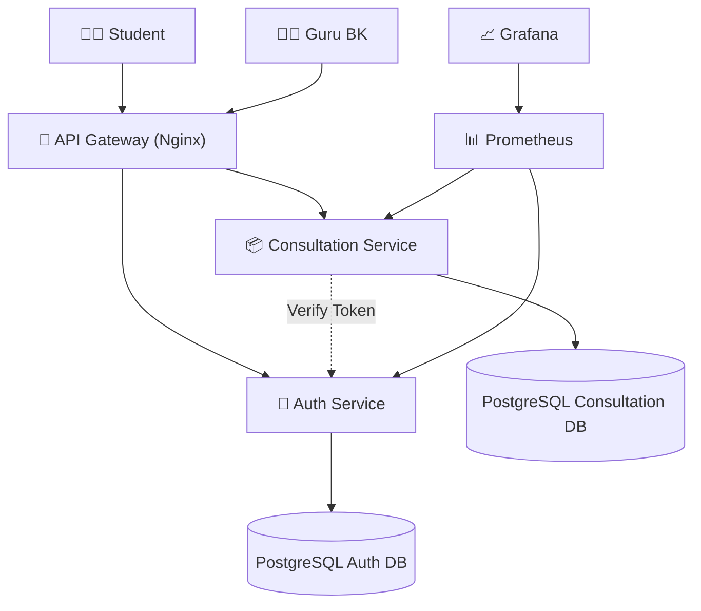

# ☁️ SafeSpace — Platform Konseling Aman & Privat


> **SafeSpace** merupakan aplikasi cloud-native berbasis web untuk layanan bimbingan konseling yang memungkinkan siswa melakukan konsultasi secara aman, privat, dan fleksibel tanpa harus memiliki akun. Aplikasi ini dibangun menggunakan arsitektur **microservices**, containerization menggunakan **Docker**, serta didukung **CI/CD Pipeline**, **API Gateway**, dan **Monitoring System** menggunakan **Prometheus** dan **Grafana** sebagai proyek Mata Kuliah **Komputasi Awan – Institut Teknologi Kalimantan**.

---

# 📚 Table of Contents

1. Overview
2. Live Demo
3. About SafeSpace
4. Core Features
5. User Roles
6. System Architecture
7. Architecture Evolution
8. Technology Stack

---

# 🌐 Live Demo

| Service               | URL                                    |
| --------------------- | -------------------------------------- |
| Frontend              | https://safespace-itk.onrender.com     |
| Backend API           | https://safespace-db.onrender.com      |
| Swagger Documentation | https://safespace-db.onrender.com/docs |

---

# 🧩 About SafeSpace

SafeSpace merupakan platform digital layanan bimbingan konseling yang dikembangkan untuk membantu proses konsultasi antara siswa dan Guru BK secara lebih modern, aman, serta menjaga privasi pengguna.

Pada sistem konvensional, proses konsultasi sering dilakukan secara langsung sehingga siswa merasa kurang nyaman untuk menyampaikan permasalahan pribadi. SafeSpace hadir sebagai solusi digital yang memungkinkan siswa mengajukan konsultasi secara anonim melalui sistem berbasis web.

Selain memberikan kemudahan bagi siswa, SafeSpace juga menyediakan dashboard khusus Guru BK untuk mengelola seluruh pengajuan konsultasi secara terstruktur dengan sistem autentikasi JWT sehingga keamanan data tetap terjaga.

Pengembangan aplikasi dilakukan menggunakan pendekatan cloud-native dengan pemisahan layanan menjadi beberapa microservices sehingga lebih mudah dikembangkan, dipelihara, serta di-deploy pada lingkungan cloud.

---

# 🎯 Objectives

SafeSpace dikembangkan dengan tujuan:

* Menyediakan platform konsultasi digital yang aman dan mudah diakses.
* Menjaga privasi siswa melalui sistem konsultasi tanpa akun.
* Membantu Guru BK mengelola konsultasi secara lebih efektif.
* Mengimplementasikan arsitektur cloud-native menggunakan Docker dan Microservices.
* Mengimplementasikan konsep CI/CD Pipeline serta monitoring service menggunakan Prometheus dan Grafana.

---

# ✨ Core Features

## 👤 Anonymous Consultation

Siswa dapat mengirim konsultasi tanpa perlu membuat akun sehingga identitas tetap lebih terjaga.

---

## 🔐 JWT Authentication

Dashboard Guru BK dilindungi menggunakan JSON Web Token (JWT) sehingga hanya pengguna yang telah login yang dapat mengakses data konsultasi.

---

## 📊 Dashboard BK

Guru BK dapat melihat seluruh daftar konsultasi yang ditujukan kepadanya beserta status dan statistik konsultasi.

---

## ✅ Accept & Reject Consultation

Guru BK dapat menerima maupun menolak pengajuan konsultasi secara langsung melalui dashboard.

---

## 📱 WhatsApp Integration

Setelah konsultasi diterima, Guru BK dapat langsung menghubungi siswa melalui tautan WhatsApp yang tersedia pada dashboard.

---

## 🔒 Data Isolation

Setiap Guru BK hanya dapat melihat data konsultasi yang menjadi tanggung jawabnya sehingga privasi antar konselor tetap terjaga.

---

## 📈 Dashboard Statistics

Dashboard menyediakan ringkasan statistik jumlah konsultasi berdasarkan status sehingga memudahkan monitoring aktivitas layanan.

---

## 🐳 Dockerized Deployment

Seluruh komponen aplikasi dapat dijalankan menggunakan Docker Compose maupun arsitektur Microservices berbasis container.

---

# 👥 User Roles

## 👨‍🎓 Student (Guest User)

Fitur yang tersedia:

* Mengisi formulir konsultasi
* Memilih Guru BK
* Mengirim konsultasi tanpa akun
* Mendapatkan tracking code
* Menjaga privasi identitas

---

## 👩‍🏫 Guidance Counselor (Guru BK)

Fitur yang tersedia:

* Register akun
* Login menggunakan JWT Authentication
* Melihat seluruh konsultasi
* Menerima konsultasi
* Menolak konsultasi
* Menghapus konsultasi
* Melihat statistik dashboard
* Menghubungi siswa melalui WhatsApp

---

# 🏗️ System Architecture


```mermaid
flowchart TD

USER["👨‍🎓 Student"]

BK["👩‍🏫 Guru BK"]

GW["🚪 API Gateway (Nginx)"]

AUTH["🔐 Auth Service"]

ITEM["📦 Consultation Service"]

ADB[("PostgreSQL Auth DB")]

IDB[("PostgreSQL Consultation DB")]

PROM["📊 Prometheus"]

GRAF["📈 Grafana"]

USER --> GW

BK --> GW

GW --> AUTH

GW --> ITEM

AUTH --> ADB

ITEM --> IDB

ITEM -. Verify Token .-> AUTH

PROM --> AUTH

PROM --> ITEM

GRAF --> PROM
```

---

# 🏛️ Architecture Components

## Frontend

Frontend dibangun menggunakan React + Vite sebagai Single Page Application (SPA) yang menyediakan antarmuka bagi siswa maupun Guru BK.

---

## API Gateway

Gateway menggunakan Nginx yang berfungsi sebagai reverse proxy untuk mengatur seluruh request menuju service yang sesuai.

Gateway juga mempermudah routing endpoint serta meningkatkan keamanan komunikasi antar service.

---

## Auth Service

Service autentikasi bertanggung jawab terhadap:

* Register Guru BK
* Login
* Generate JWT
* Validasi Token
* Informasi User

---

## Consultation Service

Service konsultasi bertanggung jawab terhadap:

* Create Consultation
* Dashboard BK
* Accept Consultation
* Reject Consultation
* Public Master Data
* Counselor List

---

## Database

Setiap service memiliki database sendiri sehingga implementasi mengikuti prinsip **Database per Service** pada arsitektur microservices.

---

## Monitoring

Monitoring dilakukan menggunakan:

* Prometheus
* Grafana

untuk mengumpulkan metrics serta memvisualisasikan performa aplikasi secara real-time.

---

# 📈 Architecture Evolution

| Phase      | Architecture                        |
| ---------- | ----------------------------------- |
| Week 1–4   | Monolith (FastAPI + React + SQLite) |
| Week 5–7   | Docker Compose                      |
| Week 8     | Integration Testing                 |
| Week 9–11  | CI/CD Pipeline                      |
| Week 12–14 | Microservices Architecture          |
| Week 15–16 | Monitoring & Final Deployment       |

---

# 🛠 Technology Stack

| Layer            | Technology      |
| ---------------- | --------------- |
| Frontend         | React + Vite    |
| Backend          | FastAPI         |
| Authentication   | JWT             |
| Validation       | Pydantic        |
| ORM              | SQLAlchemy      |
| Database         | PostgreSQL 16   |
| API Gateway      | Nginx           |
| Containerization | Docker          |
| Orchestration    | Docker Compose  |
| CI/CD            | GitHub Actions  |
| Monitoring       | Prometheus      |
| Cloud            | Render          |
| Dashboard        | Grafana         |
| Documentation    | Swagger OpenAPI |

---

# ☁️ Cloud Native Implementation

SafeSpace menerapkan konsep Cloud Computing melalui:

* Containerized Deployment menggunakan Docker
* Multi-container orchestration menggunakan Docker Compose
* Microservices Architecture
* Reverse Proxy menggunakan Nginx
* Continuous Integration menggunakan GitHub Actions
* Monitoring menggunakan Prometheus
* Dashboard Monitoring menggunakan Grafana
* Environment Configuration menggunakan .env
* Health Check setiap service
* API Documentation menggunakan Swagger UI

```
```
# 🔄 CI/CD Pipeline

SafeSpace menerapkan **Continuous Integration (CI)** menggunakan **GitHub Actions** untuk memastikan setiap perubahan kode telah melalui proses pengujian sebelum digabungkan ke branch utama.

Pipeline akan berjalan secara otomatis ketika terjadi:

* Push ke branch `main`
* Pull Request menuju branch `main`

---

## Workflow CI

```text
Developer Push
        │
        ▼
 GitHub Actions Trigger
        │
        ▼
 Test Backend (Pytest)
        │
        ▼
 Test Frontend (Vitest)
        │
        ▼
 Build Docker Images
        │
        ▼
 Health Check
        │
        ▼
 Pipeline Success
```

---

# 🚀 Quick Start

## Prerequisites

Pastikan perangkat telah terinstall:

* Docker Desktop
* Docker Compose
* Git

---

## Clone Repository

```bash
git clone https://github.com/aidilsaputrakirsan-classroom/cc-kelompok-a-suksesss.git

cd cc-kelompok-a-suksesss
```

---

## Copy Environment

Backend menggunakan file environment.

```bash
cp backend/.env.example backend/.env
```

Kemudian sesuaikan konfigurasi sesuai kebutuhan.

---

## Menjalankan Project

```bash
docker compose up -d
```

Cek container:

```bash
docker compose ps
```

---

## Akses Service

| Service      | URL                          |
| ------------ | ---------------------------- |
| Frontend     | http://localhost:3000        |
| Backend API  | http://localhost:8000        |
| Swagger      | http://localhost:8000/docs   |
| Health Check | http://localhost:8000/health |

---

# 🐳 Docker Compose

SafeSpace menggunakan Docker Compose untuk menjalankan beberapa service secara bersamaan.

Service yang tersedia:

* PostgreSQL
* Backend FastAPI
* Frontend React
* Docker Network
* Docker Volume

Container saling berkomunikasi melalui bridge network bernama:

```
safespace-network
```

---

# ☁️ Microservices Architecture

Selain arsitektur monolith, SafeSpace juga menyediakan implementasi microservices.

Untuk menjalankan:

```bash
docker compose -f docker-compose.microservices.yml up -d --build
```

---

## Services

| Service               | Port |
| --------------------- | ---- |
| API Gateway           | 8080 |
| Auth Service          | 8001 |
| Consultation Service  | 8002 |
| Auth Database         | 5434 |
| Consultation Database | 5435 |
| Prometheus            | 9090 |
| Grafana               | 3002 |

---

## Gateway

Gateway menggunakan Nginx sebagai reverse proxy.

Routing:

```
/auth/*
```

akan diarahkan menuju Auth Service.

Sedangkan:

```
/api/public/*
```

akan diarahkan menuju Consultation Service.

---

# 📡 API Documentation

Dokumentasi API tersedia melalui Swagger UI.

```
http://localhost:8000/docs
```

---

## Authentication

| Method | Endpoint                  |
| ------ | ------------------------- |
| POST   | /auth/counselors/register |
| POST   | /auth/counselor/login     |
| POST   | /auth/counselor/token     |
| GET    | /auth/me                  |
| GET    | /auth/counselor/me        |

---

## Consultation API

| Method | Endpoint                          |
| ------ | --------------------------------- |
| POST   | /api/consultations                |
| GET    | /api/bk/consultations             |
| GET    | /api/bk/consultations/{id}        |
| PATCH  | /api/bk/consultations/{id}/accept |
| PATCH  | /api/bk/consultations/{id}/reject |
| DELETE | /api/bk/consultations/{id}        |

---

## Dashboard

| Method | Endpoint                |
| ------ | ----------------------- |
| GET    | /api/bk/dashboard/stats |

---

## Public API

| Method | Endpoint                |
| ------ | ----------------------- |
| GET    | /api/public/master-data |
| GET    | /api/public/counselors  |

---

## Development API

| Method | Endpoint                  |
| ------ | ------------------------- |
| POST   | /api/dev/seed/master-data |
| POST   | /api/dev/seed/counselors  |

---

## Other API

| Method | Endpoint |
| ------ | -------- |
| GET    | /health  |
| GET    | /team    |

---

# 📊 Monitoring

SafeSpace telah mendukung monitoring menggunakan **Prometheus** dan **Grafana**.

Monitoring mempermudah developer dalam melihat kondisi service secara real-time.

---

## 📈 Grafana Dashboard

Grafana dapat diakses melalui:

```
http://localhost:3002
```

Default Login:

```
Username : admin

Password : admin
```

Grafana digunakan untuk menampilkan visualisasi metrics yang dikumpulkan dari Prometheus.

---

## 📊 Prometheus

Prometheus dapat diakses melalui:

```
http://localhost:9090/targets
```

Halaman tersebut menampilkan status scraping metrics dari seluruh microservices yang berjalan.

Monitoring dilakukan secara periodik terhadap endpoint `/metrics`.

---

# 🔐 Security

SafeSpace menerapkan beberapa mekanisme keamanan, antara lain:

* JWT Authentication
* Password Hashing
* Input Validation menggunakan Pydantic
* Environment Variable Configuration
* CORS Configuration
* Database Isolation
* Container Isolation
* Docker Network Isolation
* API Gateway Separation
* Health Check Monitoring

---

# 🧪 Testing

SafeSpace telah melalui beberapa jenis pengujian.

---

## Swagger Testing

Seluruh endpoint diuji menggunakan Swagger UI untuk memastikan request dan response berjalan sesuai spesifikasi.

---

## Blackbox Testing

Pengujian dilakukan dari sisi pengguna untuk memastikan seluruh fitur berjalan sesuai kebutuhan sistem.

---

## Health Check

Setiap service memiliki endpoint:

```
/health
```

yang digunakan untuk memastikan kondisi service dalam keadaan aktif dan siap digunakan.

# 📂 Project Structure

```text
SafeSpace/
│
├── backend/
│   ├── routers/
│   ├── scripts/
│   ├── auth.py
│   ├── crud.py
│   ├── database.py
│   ├── main.py
│   ├── models.py
│   ├── schemas.py
│   ├── requirements.txt
│   └── Dockerfile
│
├── frontend/
│   ├── public/
│   ├── src/
│   │    ├── components/
│   │    ├── services/
│   │    ├── assets/
│   │    └── App.jsx
│   ├── package.json
│   └── Dockerfile
│
├── services/
│   ├── auth-service/
│   ├── item-service/
│   └── gateway/
│
├── monitoring/
│   ├── prometheus.yml
│   └── grafana-data/
│
├── docs/
│
├── scripts/
│
├── docker-compose.yml
├── docker-compose.microservices.yml
├── README.md
└── .env.example
```

---

# 📄 Documentation

Seluruh dokumentasi project disimpan pada folder **docs/**.

| Document            | Description                                     |
| ------------------- | ----------------------------------------------- |
| Architecture Guide  | Dokumentasi arsitektur sistem dan microservices |
| Deployment Guide    | Panduan deployment Docker dan cloud             |
| Operations Guide    | Panduan operasional aplikasi                    |
| API Contract        | Dokumentasi endpoint API                        |
| Release Notes       | Riwayat perubahan aplikasi                      |

---

## Planned Documentation

Dokumen berikut akan tersedia pada folder `docs/`:

```text
docs/

├── architecture-guide.md
├── deployment-guide.md
├── operations-guide.md
├── api-contract.md
├── release-notes.md
├── docker-architecture.md
├── database-schema.md
├── swagger-testing.md
├── blackbox-testing.md
└── ui-testing.md
```

---

# 📊 Monitoring Dashboard

SafeSpace telah mendukung monitoring service menggunakan Prometheus dan Grafana.

## Grafana Dashboard

```
http://localhost:3002
```

Default Login

```
Username : admin

Password : admin
```

Grafana digunakan untuk memvisualisasikan metrics seluruh service yang sedang berjalan.

---

## Prometheus Targets

```
http://localhost:9090/targets
```

Halaman ini menampilkan status scraping metrics seluruh microservices.

Prometheus melakukan pengambilan data metrics secara otomatis dari endpoint `/metrics`.

---

# 🌐 Deployment Architecture

Implementasi deployment SafeSpace terdiri atas beberapa container:

* Frontend React
* API Gateway (Nginx)
* Auth Service
* Consultation Service
* PostgreSQL Auth Database
* PostgreSQL Consultation Database
* Prometheus
* Grafana

Seluruh container saling terhubung menggunakan Docker Network sehingga komunikasi antar service dapat berjalan secara aman.

---

# ⚙️ Environment Configuration

Konfigurasi aplikasi menggunakan file environment.

Contoh konfigurasi:

```env
APP_NAME=SafeSpace
ENVIRONMENT=development
DATABASE_URL=postgresql://...
SECRET_KEY=your-secret-key
ALGORITHM=HS256
ACCESS_TOKEN_EXPIRE_MINUTES=30
```

Konfigurasi ini mempermudah deployment pada berbagai environment tanpa perlu mengubah source code.

---

# 👥 Development Team

| Nama                       | Role               |
| -------------------------- | ------------------ |
| Rendy Rifandi Kurnia       | Backend Developer  |
| Riska Fadlun K. Purba      | Frontend Developer |
| Rizki Abdul Aziz           | DevOps Engineer    |
| Siti Nur Azizah Putri Awni | QA & Documentation |

---

# 🤝 Contribution

Project ini dikembangkan secara kolaboratif oleh Tim SafeSpace.

Kontribusi dilakukan melalui:

* Feature Branch
* Pull Request
* Code Review
* GitHub Actions CI
* Docker Build Validation

Seluruh perubahan kode harus melewati proses testing sebelum digabungkan ke branch utama.

---

# 📅 Development Roadmap

| Week | Milestone                  | Status |
| ---- | -------------------------- | ------ |
| 1    | Hello World & Setup        | ✅      |
| 2    | REST API & Database        | ✅      |
| 3    | React Frontend             | ✅      |
| 4    | Full Stack Integration     | ✅      |
| 5    | Docker Containerization    | ✅      |
| 6    | Docker Compose             | ✅      |
| 7    | Multi Container Deployment | ✅      |
| 8    | Midterm Demonstration      | ✅      |
| 9    | CI Pipeline                | ✅      |
| 10   | Automated Testing          | ✅      |
| 11   | Cloud Deployment           | ✅      |
| 12   | Auth Microservice          | ✅      |
| 13   | Consultation Microservice  | ✅      |
| 14   | API Gateway & Monitoring   | ✅      |
| 15   | Final Documentation        | ✅      |
| 16   | Final Demonstration        | ⬜      |

---

<div align="center">
  <sub>Built by Tim Suksesss</sub>
</div>