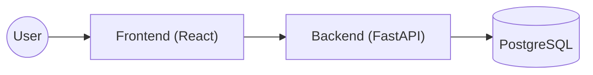

# 🛡️ SafeSpace — Platform Konseling Aman & Privat

> **SafeSpace** adalah aplikasi manajemen bimbingan konseling berbasis cloud yang dirancang untuk memberikan ruang aman bagi siswa untuk berbagi cerita dan mendapatkan bantuan dari guru BK secara privat, fleksibel, dan terstruktur.
---

## 📋 Daftar Isi

1. [Tentang SafeSpace](#-tentang-safespace)
2. [Fitur Sistem](#-fitur-sistem)
3. [Fitur Per Role](#-fitur-per-role)
4. [Arsitektur Sistem](#️-arsitektur-sistem)
5. [Tech Stack](#-tech-stack)
6. [Dokumentasi API](#-dokumentasi-api)
7. [Panduan Menjalankan Sistem](#-panduan-menjalankan-sistem)
8. [Testing](#-testing)
9. [Struktur Proyek](#-struktur-proyek)
10. [Tim Pengembang](#-tim-pengembang)

---

## 🧩 Tentang SafeSpace

### Latar Belakang

Banyak siswa merasa kesulitan untuk menyampaikan masalah pribadi secara langsung karena:

- Rasa tidak nyaman atau takut tidak privasi  
- Akses terbatas ke guru BK  
- Tidak adanya sistem terstruktur untuk pengajuan konseling  

### Solusi

SafeSpace hadir sebagai platform digital yang memungkinkan:

- Pengajuan konseling tanpa harus login  
- Privasi data siswa terjaga  
- Sistem terstruktur untuk guru BK dalam mengelola pengajuan  
---

## ✨ Fitur Sistem

### 🔹 1. Pengajuan Konseling (Tanpa Login)
- Siswa dapat langsung mengisi form tanpa akun  
- Data yang diinput:
  - Nama lengkap  
  - Nomor WhatsApp
  - Jenis kelamin  
  - Kelas  
  - Guru BK pilihan  
  - Metode konseling  
  - Topik masalah  
  - Tanggal & waktu  
  - Tempat  
---

### 🔹 2. Dashboard Guru BK
- Login & register akun  
- Melihat daftar pengajuan konseling  
- Status:
  - Pending  
  - Accepted  
  - Rejected  
- Aksi:
  - Terima  
  - Tolak  
  - Hapus  
---

### 🔹 3. Integrasi WhatsApp
- Saat diterima:
  - Otomatis kirim pesan ke siswa  
- Saat ditolak:
  - Kirim alasan penolakan  
---

### 🔹 4. Security & Privacy
- JWT Authentication untuk guru BK  
- Data terpisah antar guru BK  
- Endpoint terproteksi  

---

## 👥 Fitur Per Role

### 👤 Siswa (Tanpa Login)

| Fitur | Deskripsi |
|------|----------|
| Isi Form Konseling | Mengajukan permintaan konseling |
| Pilih Guru BK | Menentukan tujuan konseling |
| Pilih Jadwal | Tanggal & waktu fleksibel |
| Privasi Terjaga | Data hanya dilihat guru terkait |

---

### 👩‍🏫 Guru BK

| Fitur | Deskripsi |
|------|----------|
| Register & Login | Akses dashboard |
| Lihat Pengajuan | Semua data siswa |
| Accept / Reject | Kelola permintaan |
| WhatsApp Integration | Hubungi siswa langsung |
| Data Isolated | Tidak bisa lihat data guru lain |

---

## 🏗️ Arsitektur Sistem


```mermaid
graph LR
    User((User)) --> Frontend["Frontend (React)"]
    Frontend --> Backend["Backend (FastAPI)"]
    Backend --> DB[("PostgreSQL")]
```

### 🔹 Detail Container

| Service | Port | Fungsi |
|--------|------|--------|
| Frontend | 3000 | UI React |
| Backend | 8000 | API FastAPI |
| Database | 5433 | PostgreSQL |

---

## 🛠️ Tech Stack

| Kategori | Teknologi |
|---------|----------|
| Frontend | React + Vite |
| Backend | FastAPI (Python) |
| Database | PostgreSQL |
| Auth | JWT |
| Container | Docker |
| API Docs | Swagger UI |

---

## 📡 Dokumentasi API

Beberapa endpoint utama:

| Method | Endpoint | Deskripsi |
|-------|----------|----------|
| GET | /health | Cek status API |
| POST | /auth/register | Register guru BK |
| POST | /auth/login | Login |
| GET | /auth/me | Data user login |
| POST | /items | Tambah pengajuan |
| GET | /items | Ambil data |
| GET | /items/{id} | Detail data |
| PUT | /items/{id} | Update |
| DELETE | /items/{id} | Hapus |
| GET | /items/stats | Statistik |
| GET | /team | Info tim |

📄 Swagger UI:  
http://localhost:8000/docs

---

## 🚀 Panduan Menjalankan Sistem

### 🔹 Menggunakan Docker

```bash
docker compose up -d
```

Cek status:

```bash
docker compose ps
```

---

### 🔹 Akses Aplikasi

| Layanan | URL |
|--------|-----|
| Frontend | http://localhost:3000 |
| Backend | http://localhost:8000 |
| Swagger | http://localhost:8000/docs |

---

## 🧪 Testing

### 🔹 1. Swagger Testing

Yang diuji:
- Endpoint berjalan  
- Response sesuai  
- Auth bekerja  
- CRUD berhasil  

---

### 🔹 2. Black Box Testing

Yang dicek:
- Form input validasi  
- Login berhasil / gagal  
- Accept / Reject berfungsi  
- Data tampil sesuai  

---

## 📂 Struktur Proyek

```
cc-kelompok-a-suksesss/
├── backend/                     # FastAPI Backend
│   ├── Dockerfile               # Docker image configuration (NEW)
│   ├── .dockerignore            # Docker ignore rules (NEW)
│   ├── main.py                  # Entry point, API routes & CORS config
│   ├── auth.py                  # JWT authentication utilities
│   ├── database.py              # Database connection
│   ├── models.py                # SQLAlchemy models (+ User model)
│   ├── schemas.py               # Pydantic schemas (+ auth schemas)
│   ├── crud.py                  # Business logic & CRUD operations
│   ├── requirements.txt         # Python dependencies
│   ├── .env                     # Environment variables (Updated for Docker)
│   └── .env.example             # Example environment configuration
│
├── frontend/                    # React Frontend (Vite)
│   ├── src/
│   │   ├── App.jsx              # Root component + auth integration
│   │   ├── App.css              # Main styling
│   │   ├── main.jsx             # React entry point
│   │   │
│   │   ├── components/
│   │   │   ├── Header.jsx       # Header + user info & logout
│   │   │   ├── LoginPage.jsx    # Login page
│   │   │   ├── SearchBar.jsx    # Item search feature
│   │   │   ├── ItemForm.jsx     # Add & edit item form
│   │   │   ├── ItemList.jsx     # Item list display
│   │   │   └── ItemCard.jsx     # Item card component
│   │   │
│   │   └── services/
│   │       └── api.js           # API service + token management
│   │
│   ├── .env                     # Frontend environment variables
│   ├── .env.example             # Example environment configuration
│   ├── index.html               # Main HTML template
│   ├── package.json             # Node.js dependencies & scripts
│   ├── vite.config.js           # Vite configuration
│   └── eslint.config.js         # ESLint configuration
│
├── docs/                        # Team documentation & testing results
│   ├── member-Azizah.md
│   ├── member-Rendy.md
│   ├── member-Riska.md
│   ├── member-Rizki.md
│   ├── api-test-results.md      # API testing documentation (Swagger)
│   ├── ui-test-results.md       # UI testing documentation
│   ├── image-comparison.md      # Docker image comparison (NEW)
│   ├── docker-cheatsheet.md     # Docker command reference (NEW)
│   └── images/                  # Testing screenshots
│
├── .gitignore
└── README.md
```

---

## 👥 Tim Pengembang

| Nama | Role | GitHub |
|------|------|--------|
| Rendy Rifandi Kurnia | Backend | NorEndGate |
| Riska Fadlun Khairiyah Purba | Frontend | risch24 |
| Rizki Abdul Aziz | DevOps | rizkiiaaz |
| Siti Nur Azizah Putri Awni | QA & Docs | Azizah66 |

---

<div align="center">
  <sub>Built by SafeSpace Team</sub>
</div>