# Dokumentasi Hasil Testing Endpoint Via Swagger/Thunder Client

1. Pengujian Create Item (Post /items) yang berfungsi menambahkan data item baru ke dalam database, dengan menambahkan 3 item (BERHASIL✅)
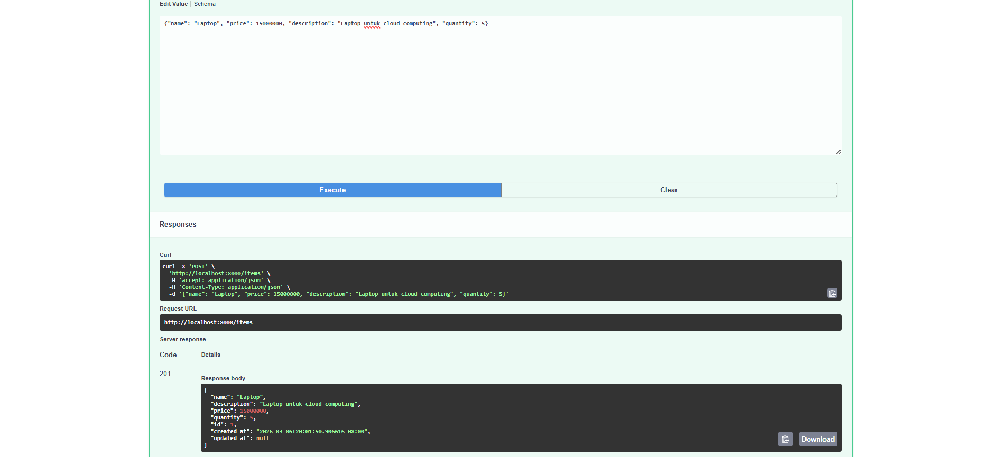
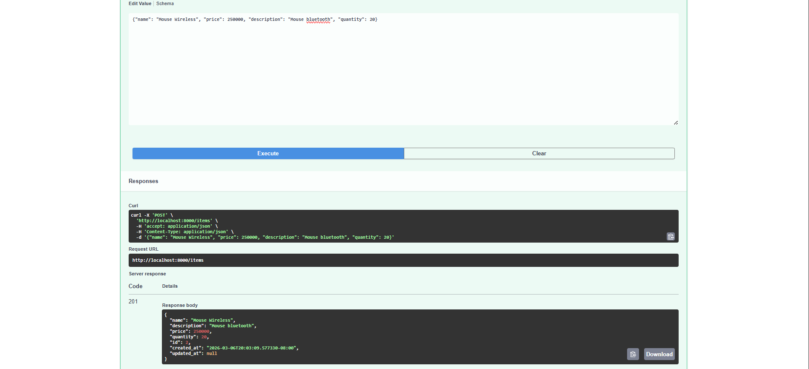
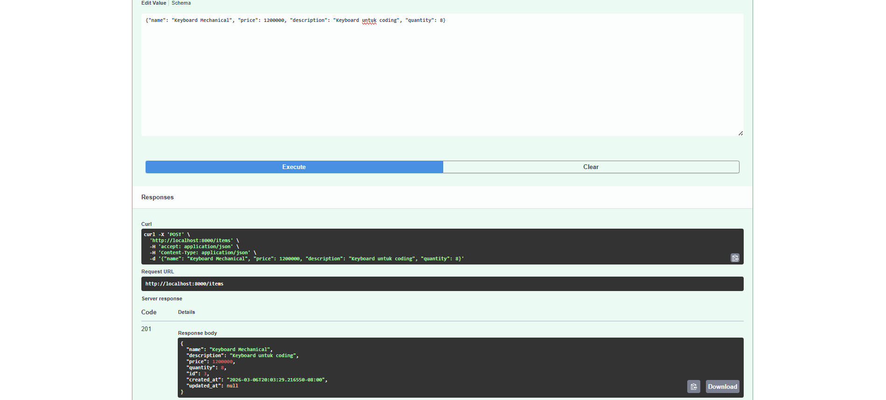
Hasil pengujian menunjukkan server memberikan response 201 Created, yang berarti data item berhasil ditambahkan ke database

2. Pengujian List Items (GET /items) untuk memastikan endpoint GET/items menampilkan seluruh data item yang tersimpan dalam db (BERHASIL✅)
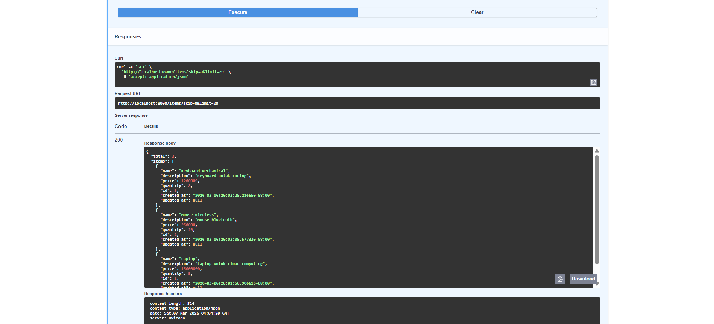
Pada pengujian ini sistem berhasil menampilkan tiga item yang telah ditambahkan yaitu laptop, mouse wireless, dan keyboard mechanical

3. Pengujian Get Item by ID (GET /items/{item_id}) untuk mengambil satu data item berdasarkan ID tertentu (BERHASIL✅)
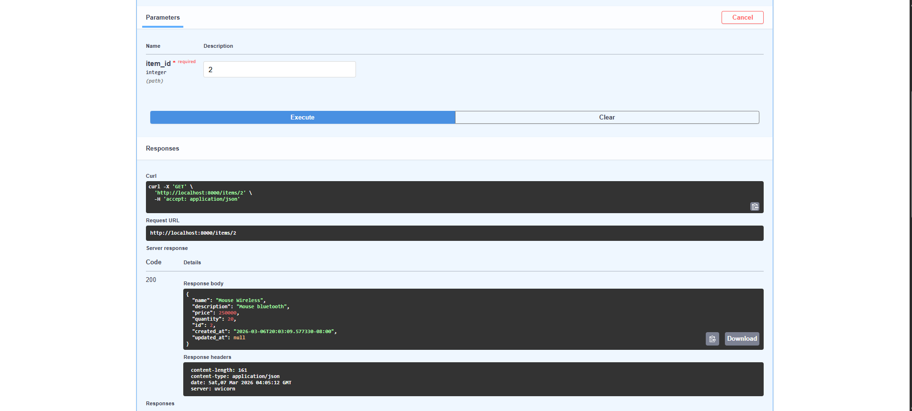
Hasil pengujian menunjukkan sistem berhasil menampilkan data item mouse wireless dengan ID yang sesuai.

4. Pengujian Update Item (PUT /items/{item_id}) untuk memastikan data item dapat diperbarui (BERHASIL✅)
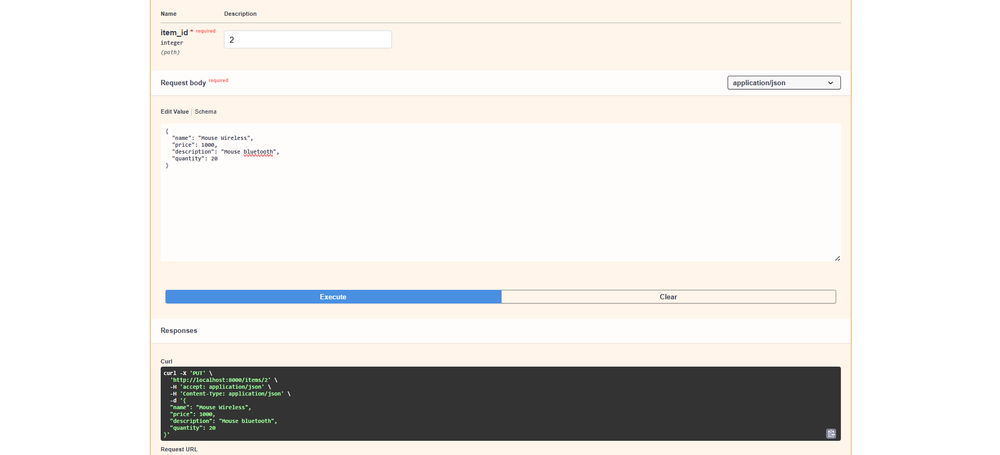

5. Verifikasi Update Data (GET /items/{item_id}), dilakukan pengujian kembali menggunakan endpoint GET /items/1 untuk memastikan bahwa perubahan data telah berhasil disimpan. Hasil response menunjukkan bahwa harga item mouse wireless telah berubah dari 250000 menjadi 1000 sesuai dengan perubahan yang dilakukan sebelumnya.(BERHASIL✅)
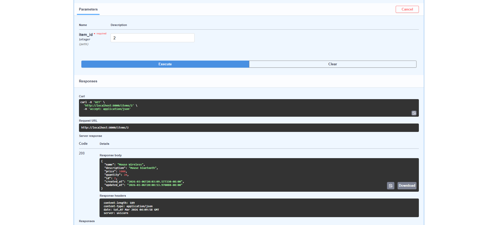

6. Pengujian Search Item (GET /items?search=mouse wireless)(BERHASIL✅)
Endpoint GET /items juga menyediakan fitur pencarian data menggunakan parameter query search untuk mempermudah pencarian item tertentu dalam jumlah data yang besar. Hasil pengujian menunjukkan bahwa sistem berhasil menampilkan satu item yang sesuai dengan kata kunci pencarian yaitu mouse wireless
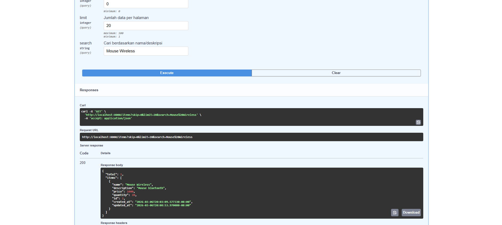

7. Pengujian Delete Item (DELETE /items/{item_id}) untuk menghapus data item dari database. Server memberikan response 204 No Content yang menandakan bahwa proses penghapusan data berhasil dilakukan (BERHASIL✅)
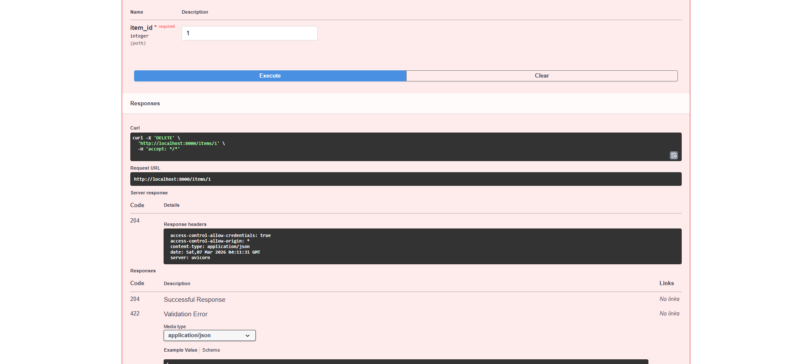

8. Verifikasi Penghapusan Data (GET /items/{item_id}). Hasil response yang diberikan server adalah 404 Not Found yang menunjukkan bahwa data item tersebut sudah tidak tersedia di database (BERHASIL✅)
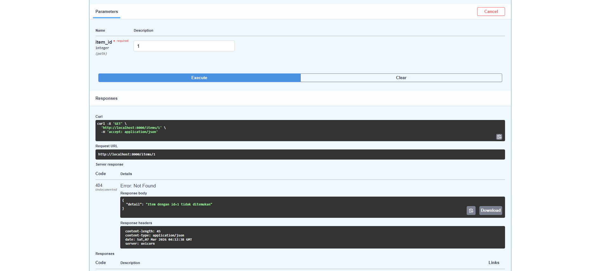

9. GET /items/stats memberi ringkasan statistik dari semua item (ini saya testing saat sudah menyelesaikan tahapan diatas) (BERHASIL✅)
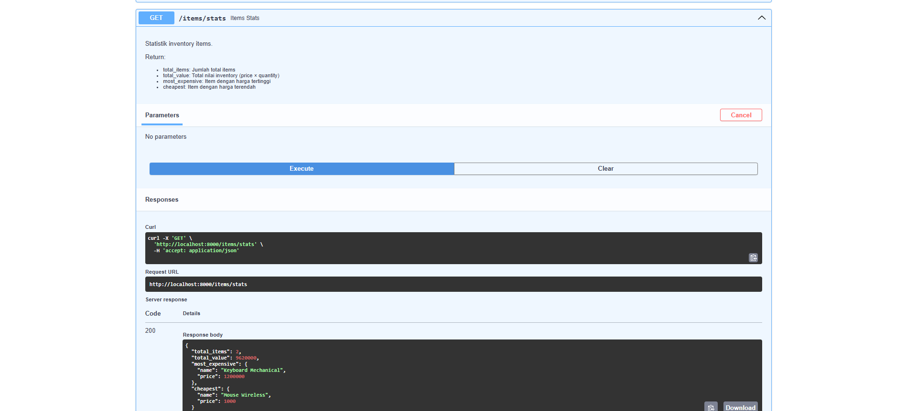

10. GET /health untuk mengecek apakah server API sedang hidup dan berfungsi (BERHASIL✅)
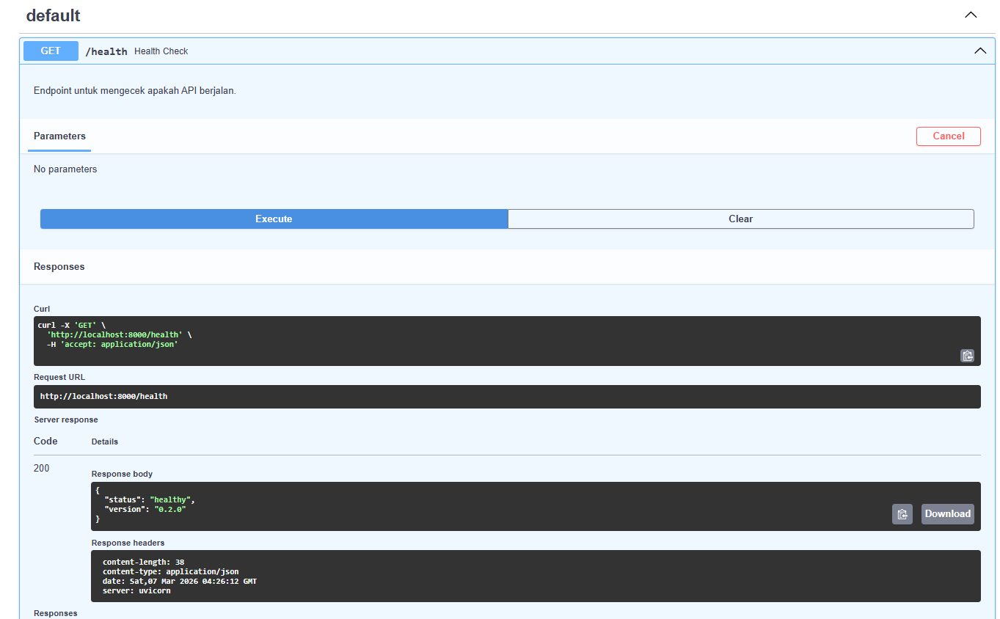

## Kesimpulan
Berdasarkan hasil pengujian yang telah dilakukan, seluruh endpoint REST API berhasil berjalan dengan baik. Operasi Create, Read, Update, dan Delete (CRUD) dapat dilakukan tanpa error melalui Swagger UI. Selain itu fitur tambahan seperti pencarian data, statistik item, dan health check juga berfungsi dengan baik sesuai dengan kebutuhan sistem.