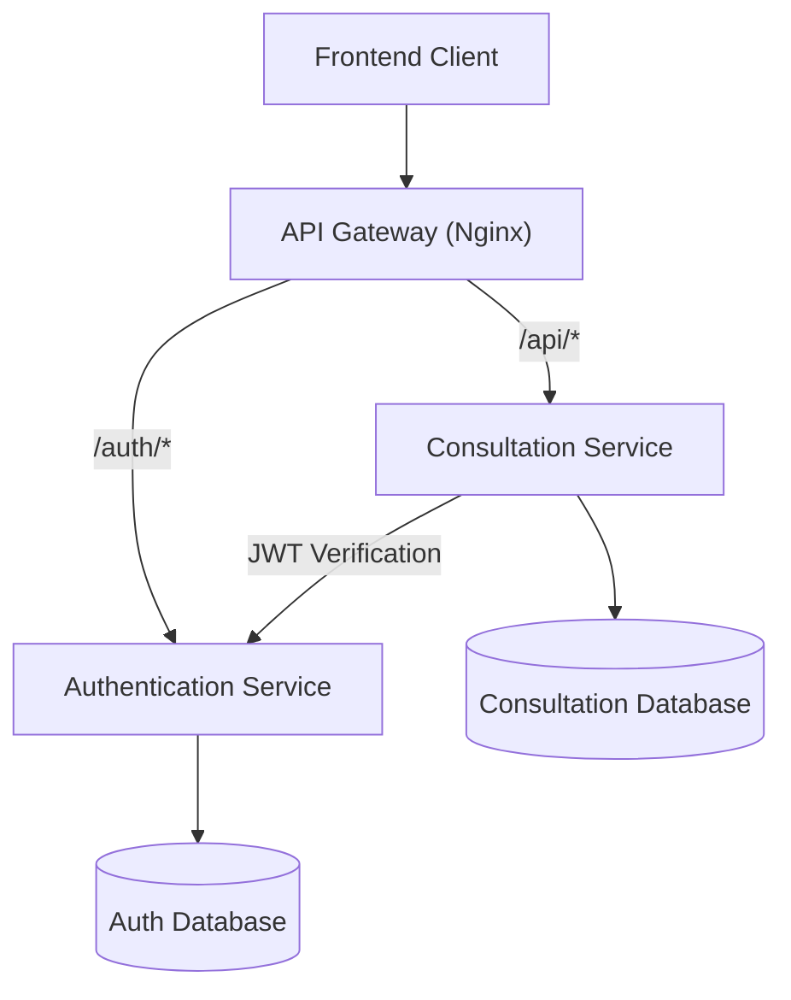

# 🏗️ SafeSpace Microservices Architecture

## Overview

SafeSpace menggunakan arsitektur **microservices** untuk memisahkan proses autentikasi dan pengelolaan konsultasi ke dalam layanan yang independen. Dengan pendekatan ini, setiap service memiliki tanggung jawab yang spesifik sehingga sistem lebih mudah dikembangkan, dipelihara, dan diskalakan.

Arsitektur SafeSpace terdiri dari beberapa komponen utama:

* Frontend (React + Vite)
* API Gateway (Nginx)
* Authentication Service
* Consultation Service
* Authentication Database (PostgreSQL)
* Consultation Database (PostgreSQL)

Seluruh request dari client akan diteruskan melalui API Gateway sebelum diproses oleh service yang sesuai.

---

# Architecture Diagram



# 🔌 Services & Ports

| Service                | Port               | Description                     |
| ---------------------- | ------------------ | ------------------------------- |
| Frontend               | Internal Container | React + Vite Client             |
| API Gateway            | 8080               | Reverse Proxy & Request Routing |
| Authentication Service | 8001               | Authentication & JWT Management |
| Consultation Service   | 8002               | Consultation Management         |
| Auth Database          | 5434               | PostgreSQL Database             |
| Consultation Database  | 5435               | PostgreSQL Database             |

---

# API Gateway Routing

API Gateway menggunakan **Nginx** untuk meneruskan request ke service yang sesuai.

| Route     | Destination            |
| --------- | ---------------------- |
| `/auth/*` | Authentication Service |
| `/api/*`  | Consultation Service   |

Contoh:

```
POST http://localhost:8080/auth/counselor/login
```

akan diteruskan ke Authentication Service.

Sedangkan:

```
GET http://localhost:8080/api/bk/consultations
```

akan diteruskan ke Consultation Service.

---

# Authentication Service API Contract

Base URL:

```
http://localhost:8080/auth
```

## POST /auth/counselors/register

Melakukan registrasi akun Guru BK baru.

---

## POST /auth/counselor/login

Melakukan login menggunakan email dan password, kemudian menghasilkan JWT Token.

---

## POST /auth/counselor/token

OAuth2 login endpoint yang digunakan untuk autentikasi berbasis token.

---

## GET /auth/me

Mengambil informasi user yang sedang login.

---

## GET /auth/counselor/me

Mengambil informasi akun counselor yang sedang login.

---

# Consultation Service API Contract

Base URL:

```
http://localhost:8080/api
```

## POST /consultations

Membuat pengajuan konsultasi baru.

---

## GET /bk/consultations

Mengambil daftar konsultasi untuk Guru BK.

---

## GET /bk/consultations/{consultation_id}

Mengambil detail konsultasi berdasarkan ID.

---

## PATCH /bk/consultations/{consultation_id}/accept

Menerima pengajuan konsultasi.

---

## PATCH /bk/consultations/{consultation_id}/reject

Menolak pengajuan konsultasi.

---

## DELETE /bk/consultations/{consultation_id}

Menghapus data konsultasi.

---

## GET /bk/dashboard/stats

Mengambil statistik dashboard Guru BK.

---

## GET /api/public/master-data

Mengambil data master yang dapat diakses publik.

---

## GET /api/public/counselors

Mengambil daftar Guru BK yang tersedia.

---

# Inter-Service Communication

SafeSpace menggunakan mekanisme JWT Authentication antar service.

Alur komunikasi:

1. User melakukan login melalui Authentication Service.
2. Authentication Service menghasilkan JWT Token.
3. Frontend menyimpan token dan mengirimkannya pada setiap request yang membutuhkan autentikasi.
4. API Gateway meneruskan request ke Consultation Service.
5. Consultation Service melakukan verifikasi token melalui Authentication Service.
6. Setelah token valid, request diproses dan response dikembalikan ke client.

```
Frontend
    │
    ▼
API Gateway
    │
    ▼
Consultation Service
    │
    ▼
Authentication Service
    │
    ▼
JWT Validation
```

---

# Health Check

Sistem menyediakan endpoint health check untuk memastikan seluruh service berjalan dengan baik.

| Endpoint  | Fungsi                  |
| --------- | ----------------------- |
| `/health` | Mengecek status service |

Endpoint ini digunakan pada Docker Health Check maupun proses monitoring sistem.

---

# Running Locally

Menjalankan seluruh microservices:

```bash
docker compose -f docker-compose.microservices.yml up -d --build
```

Melihat status container:

```bash
docker compose -f docker-compose.microservices.yml ps
```

Menghentikan seluruh service:

```bash
docker compose -f docker-compose.microservices.yml down
```

---

# Quick Testing

## Health Check

```bash
curl http://localhost:8080/health
```

---

## Register Counselor

```bash
curl -X POST http://localhost:8080/auth/counselors/register
```

---

## Login Counselor

```bash
curl -X POST http://localhost:8080/auth/counselor/login
```

---

## Get Consultation List

```bash
curl http://localhost:8080/api/bk/consultations
```

---

# Debugging Guide

## Authentication Service

```bash
docker logs safespace-auth-service
```

---

## Consultation Service

```bash
docker logs safespace-item-service
```

---

## API Gateway

```bash
docker logs safespace-gateway
```

---

## Authentication Database

```bash
docker logs safespace-auth-db
```

---

## Consultation Database

```bash
docker logs safespace-item-db
```

---

# Troubleshooting

## Authentication gagal

Kemungkinan penyebab:

* Service belum berjalan
* JWT tidak valid
* Database belum siap

Solusi:

```bash
docker compose -f docker-compose.microservices.yml ps
docker logs safespace-auth-service
```

---

## Consultation Service tidak dapat diakses

Kemungkinan penyebab:

* Service belum healthy
* Koneksi ke database gagal
* Auth Service belum tersedia

Solusi:

```bash
docker logs safespace-item-service
```

---

## Gateway Error

Kemungkinan penyebab:

* Authentication Service belum ready
* Consultation Service belum ready
* Konfigurasi Nginx tidak sesuai

Solusi:

```bash
docker logs safespace-gateway
```

---

## Database Connection Error

Kemungkinan penyebab:

* PostgreSQL belum berjalan
* Environment variable DATABASE_URL tidak sesuai

Solusi:

```bash
docker logs safespace-auth-db
docker logs safespace-item-db
```

---

# Conclusion

Implementasi arsitektur microservices pada SafeSpace memungkinkan pemisahan proses autentikasi dan pengelolaan konsultasi ke dalam service yang independen. Dengan bantuan API Gateway, komunikasi antar service menjadi lebih terstruktur, aman, dan mudah dikembangkan. Pendekatan ini mendukung skalabilitas aplikasi serta mempermudah proses maintenance dan deployment di lingkungan production.