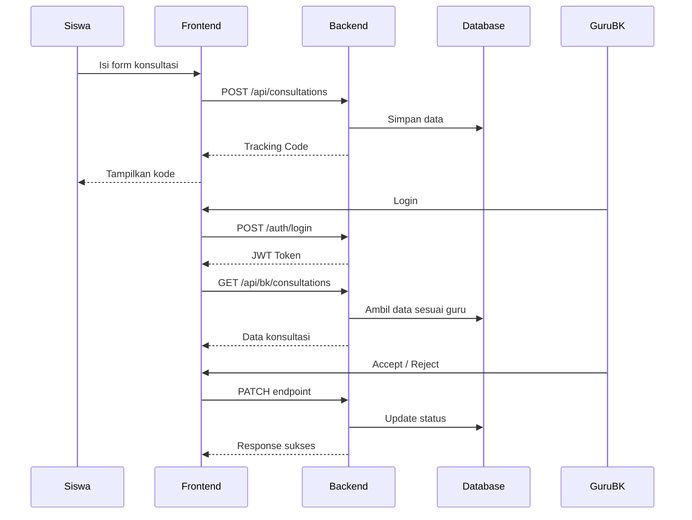

## 🏗️ Arsitektur Sistem

Arsitektur SafeSpace menggunakan pendekatan **3-tier architecture** yang dipisahkan menjadi frontend, backend, dan database, serta didukung oleh containerization menggunakan Docker.

---

### 🔷 1. High-Level Architecture

📌 **Penjelasan:**
- User (Siswa & Guru BK) mengakses aplikasi melalui browser
- Frontend mengirim request ke backend melalui REST API
- Backend memproses data & berinteraksi dengan database
- Response dikembalikan dalam bentuk JSON ke frontend

---

### 🔷 2. Docker Multi-Container Architecture

📌 **Penjelasan:**
- Semua service berjalan dalam container terpisah
- Terhubung melalui Docker network `cloudnet`
- Backend menggunakan hostname `db` untuk akses database
- Data database disimpan menggunakan Docker volume (`pgdata`)

---

### 🔷 3. Backend Architecture (FastAPI)

📌 **Penjelasan:**
- **API Router** → menangani endpoint (auth, consultations, dashboard)
- **Authentication (JWT)** → melindungi akses khusus Guru BK
- **Validation (Pydantic)** → memastikan data request valid
- **Business Logic** → mengelola proses konsultasi (create, accept, reject)
- **Database** → menyimpan data siswa & konsultasi

---

### 🔷 4. Frontend Architecture (React)

📌 **Penjelasan:**
- **UI Components** → halaman utama, form konsultasi, dashboard BK
- **State Management** → menyimpan state (form input, auth token)
- **API Service (Axios)** → komunikasi ke backend
- **Backend** → memproses request & mengembalikan data

---

### 🔷 5. Alur Sistem SafeSpace (Use Case Flow)

📌 **Penjelasan:**
- Siswa dapat mengajukan konsultasi tanpa login
- Sistem menghasilkan tracking code
- Guru BK login untuk mengelola konsultasi
- Data bersifat **terisolasi per guru BK**
- Proses accept/reject dilakukan secara real-time

---

### 🔷 6. Keunggulan Arsitektur

- 🧩 **Modular** → frontend, backend, database terpisah
- 🔐 **Secure** → JWT authentication untuk akses terbatas
- ⚡ **Scalable** → mudah dikembangkan dan ditambah fitur
- ☁️ **Cloud-ready** → siap deploy menggunakan Docker
- 🔒 **Privacy-first** → data konsultasi hanya dapat diakses oleh guru terkait

---

## ✅ Kesimpulan

Arsitektur SafeSpace dirancang untuk:
- Mendukung layanan konseling yang aman & privat
- Memastikan pemisahan tanggung jawab antar sistem
- Memudahkan deployment dan pengembangan berkelanjutan

Dengan kombinasi React, FastAPI, PostgreSQL, dan Docker, aplikasi ini menjadi solusi digital yang **modern, aman, dan scalable**.