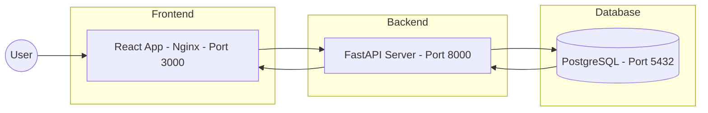
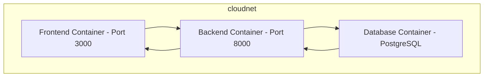
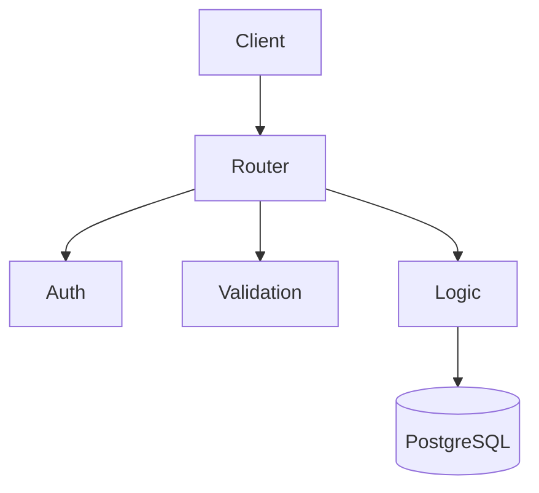
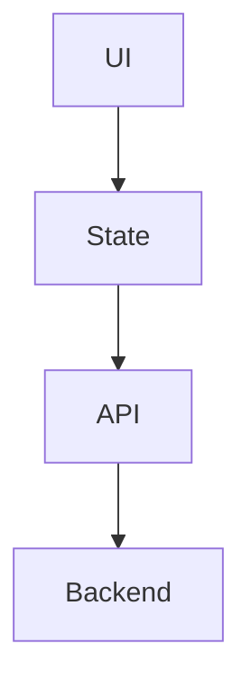
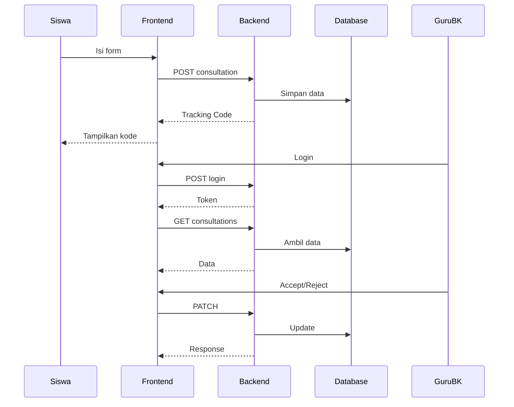

## 🏗️ Arsitektur Sistem

Arsitektur SafeSpace menggunakan pendekatan **3-tier architecture** yang dipisahkan menjadi frontend, backend, dan database, serta didukung oleh containerization menggunakan Docker.

---

### 🔷 1. High-Level Architecture

📌 **Penjelasan:**
- User (Siswa & Guru BK) mengakses aplikasi melalui browser
- Frontend mengirim request ke backend melalui REST API
- Backend memproses data & berinteraksi dengan database
- Response dikembalikan dalam bentuk JSON ke frontend

---

### 🔷 2. Docker Multi-Container Architecture

📌 **Penjelasan:**
- Semua service berjalan dalam container terpisah
- Terhubung melalui Docker network `cloudnet`
- Backend menggunakan hostname `db` untuk akses database
- Data database disimpan menggunakan Docker volume (`pgdata`)

---

### 🔷 3. Backend Architecture (FastAPI)

📌 **Penjelasan:**
- API Router menangani endpoint (auth, consultations, dashboard)
- Authentication (JWT) melindungi akses Guru BK
- Validation memastikan data request valid
- Business Logic mengelola proses konsultasi
- Database menyimpan data

---

### 🔷 4. Frontend Architecture (React)

📌 **Penjelasan:**
- UI Components: halaman & form
- State Management: menyimpan data & token
- API Service: komunikasi ke backend
- Backend: memproses request

---

### 🔷 5. Alur Sistem SafeSpace (Use Case Flow)

📌 **Penjelasan:**
- Siswa dapat mengajukan konsultasi tanpa login
- Sistem menghasilkan tracking code
- Guru BK login untuk mengelola konsultasi
- Data terisolasi per guru BK
- Accept/reject dilakukan secara real-time

---

### 🔷 6. Keunggulan Arsitektur

- Modular (frontend, backend, database terpisah)
- Secure (JWT authentication)
- Scalable (mudah dikembangkan)
- Cloud-ready (Docker)
- Privacy-first (data terisolasi)

---

## ✅ Kesimpulan

Arsitektur SafeSpace dirancang untuk:
- Mendukung layanan konseling yang aman & privat
- Memastikan pemisahan tanggung jawab sistem
- Memudahkan deployment dan pengembangan

Dengan kombinasi React, FastAPI, PostgreSQL, dan Docker, aplikasi ini menjadi solusi digital yang modern, aman, dan scalable.