# 🧪 Blackbox Testing — SafeSpace

Dokumen ini berisi pengujian **Blackbox Testing** pada aplikasi SafeSpace.  
Metode ini berfokus pada pengujian fungsi sistem dari sisi pengguna tanpa melihat kode internal.

---

## 📍 Informasi Umum

- Nama Aplikasi: SafeSpace
- Tipe Testing: Blackbox Testing
- Fokus: Functional Testing (UI & Flow)
- Environment: Browser (Chrome)
- URL: https://safespace-itk.onrender.com/

---

## 🎯 Tujuan Pengujian

- Memastikan seluruh fitur berjalan sesuai kebutuhan user
- Memvalidasi input form
- Menguji alur sistem end-to-end
- Memastikan tidak ada error dari sisi pengguna

---

## 👤 A. Testing Role: Siswa (Tanpa Login)

### 1. Akses Halaman Utama

| ID | Skenario | Langkah | Expected Result | Status |
|----|----------|--------|----------------|--------|
| BB-01 | Buka homepage | Akses https://safespace-itk.onrender.com/ | Halaman tampil normal | ✅ Pass |

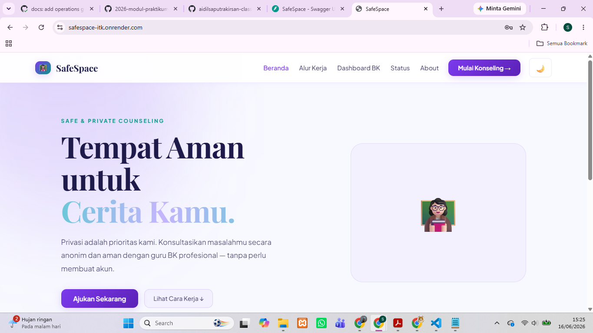
---

### 2. Form Pengajuan Konseling

| ID | Skenario | Langkah | Expected Result | Status |
|----|----------|--------|----------------|--------|
| BB-02 | Isi form lengkap | Isi semua field valid | Form berhasil dikirim | ✅ Pass |
| BB-03 | Field kosong | Submit tanpa isi | Muncul validasi error | ✅ Pass |
| BB-04 | Pilih guru BK | Pilih salah satu opsi | Data tersimpan sesuai pilihan | ✅ Pass |
| BB-05 | Pilih tanggal | Input tanggal valid | Data diterima sistem | ✅ Pass |

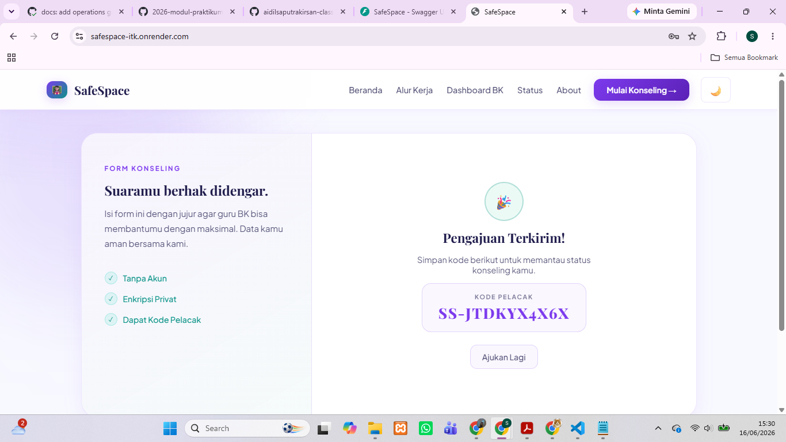
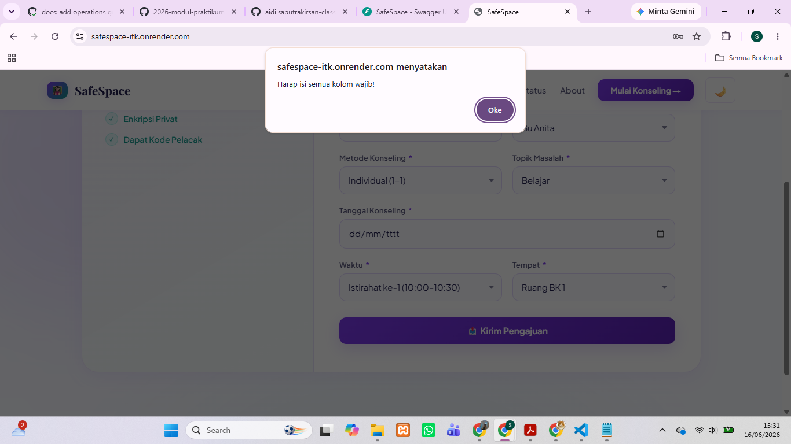

---

### 3. Submit Pengajuan

| ID | Skenario | Langkah | Expected Result | Status |
|----|----------|--------|----------------|--------|
| BB-06 | Kirim pengajuan | Klik "Kirim" | Pengajuan berhasil | ✅ Pass |
| BB-07 | Tracking code muncul | Setelah submit | Kode unik tampil | ✅ Pass |
| BB-08 | Ajukan ulang | Klik "Ajukan Lagi" | Kembali ke form | ✅ Pass |

---

## 👩‍🏫 B. Testing Role: Guru BK

### 1. Register

| ID | Skenario | Langkah | Expected Result | Status |
|----|----------|--------|----------------|--------|
| BB-09 | Register valid | Isi semua field | Akun berhasil dibuat | ✅ Pass |
| BB-10 | Email duplikat | Register email sama | Error muncul | ✅ Pass |
| BB-11 | Password kosong | Submit tanpa password | Validasi error | ✅ Pass |

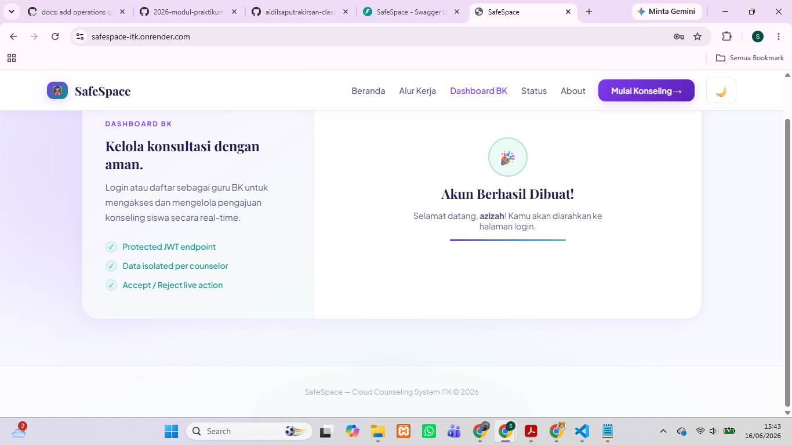
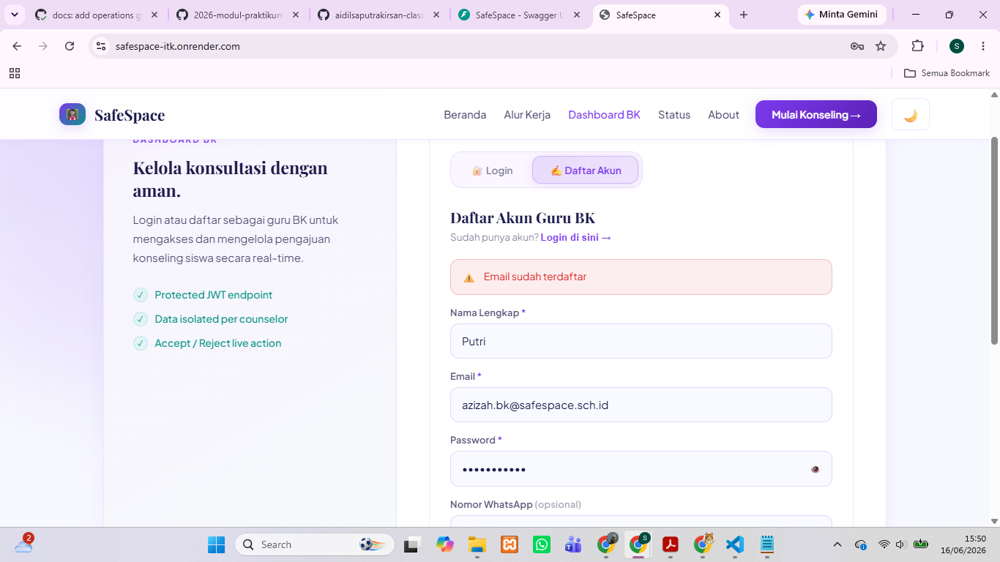
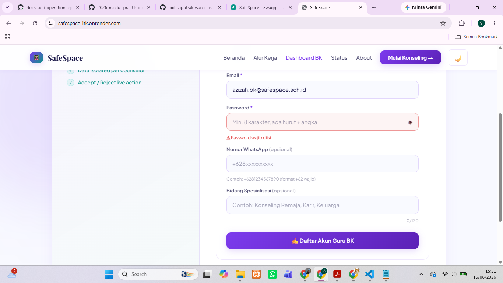

---

### 2. Login

| ID | Skenario | Langkah | Expected Result | Status |
|----|----------|--------|----------------|--------|
| BB-12 | Login valid | Input benar | Masuk dashboard | ✅ Pass |
| BB-13 | Password salah | Input salah | Login gagal | ✅ Pass |
| BB-14 | Field kosong | Submit kosong | Validasi error | ✅ Pass |

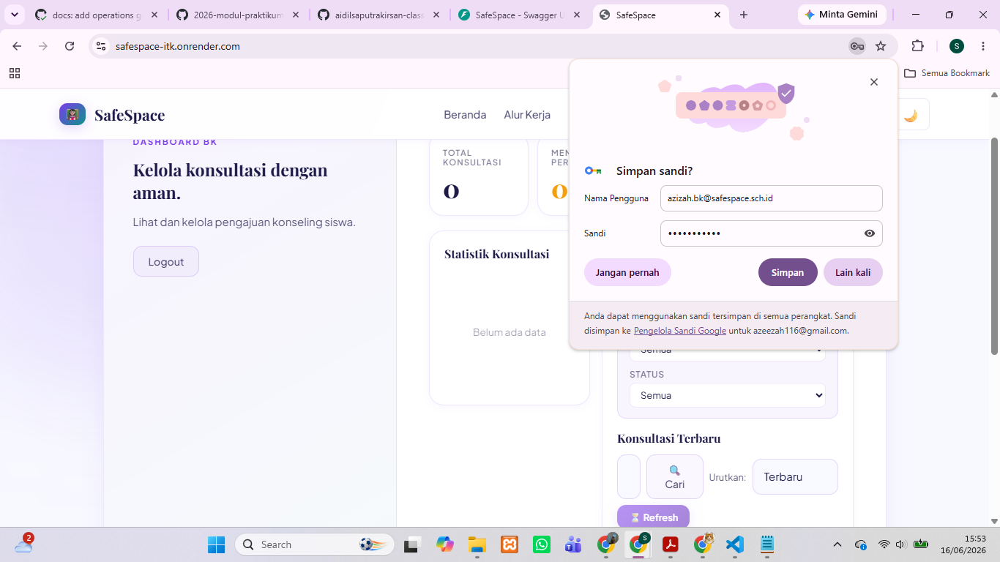
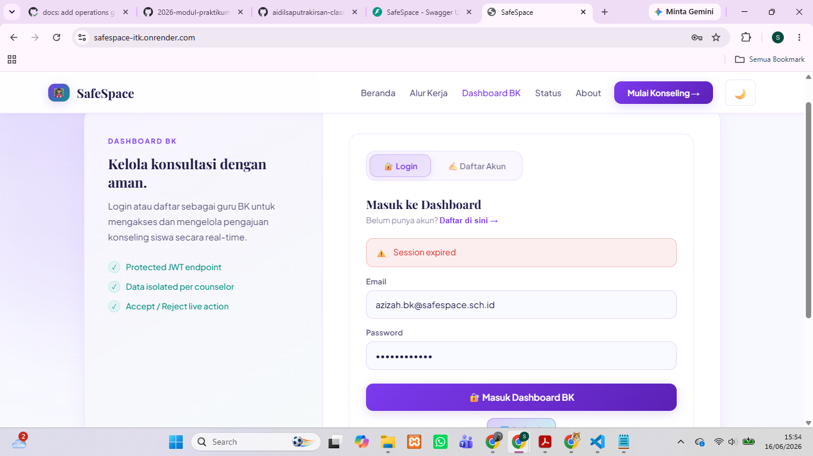
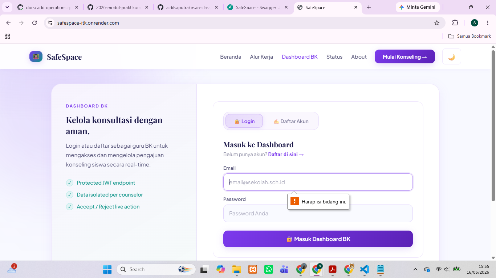

---

### 3. Dashboard Konseling

| ID | Skenario | Langkah | Expected Result | Status |
|----|----------|--------|----------------|--------|
| BB-16 | Lihat data konsultasi | Buka dashboard | Data tampil | ✅ Pass |
| BB-17 | Filter status | Lihat pending/accepted/rejected | Data sesuai filter | ✅ Pass |

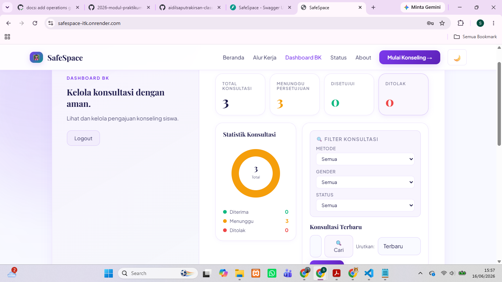
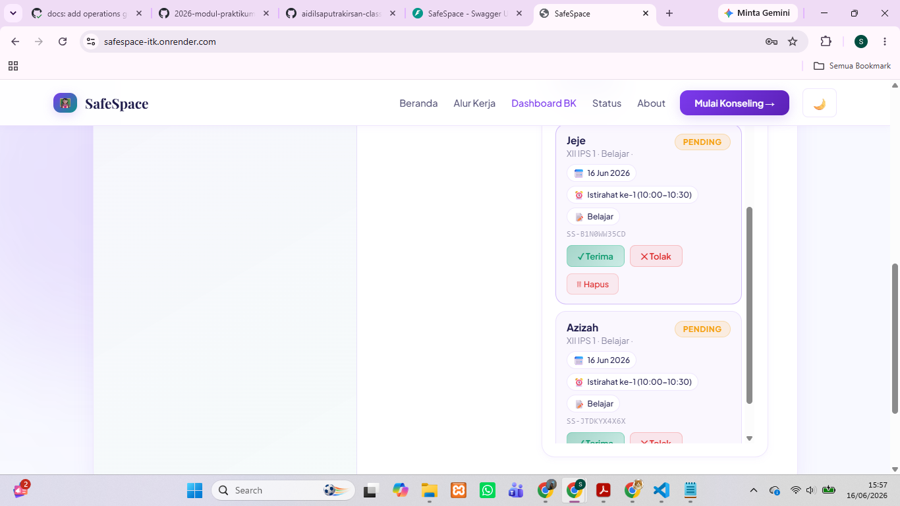
---

### 4. Accept / Reject Konseling

| ID | Skenario | Langkah | Expected Result | Status |
|----|----------|--------|----------------|--------|
| BB-18 | Accept konsultasi | Klik tombol accept | Status berubah jadi accepted | ✅ Pass |
| BB-19 | Reject konsultasi | Klik reject | Status berubah jadi rejected | ✅ Pass |
| BB-20 | WhatsApp auto message (accept) | Klik accept | Redirect WA + pesan otomatis | ✅ Pass |
| BB-21 | WhatsApp auto message (reject) | Klik reject | Redirect WA + pesan penolakan | ✅ Pass |
| BB-21 | Hapus Konsultasi | Klik hapus | Pesan peringatan | ✅ Pass |

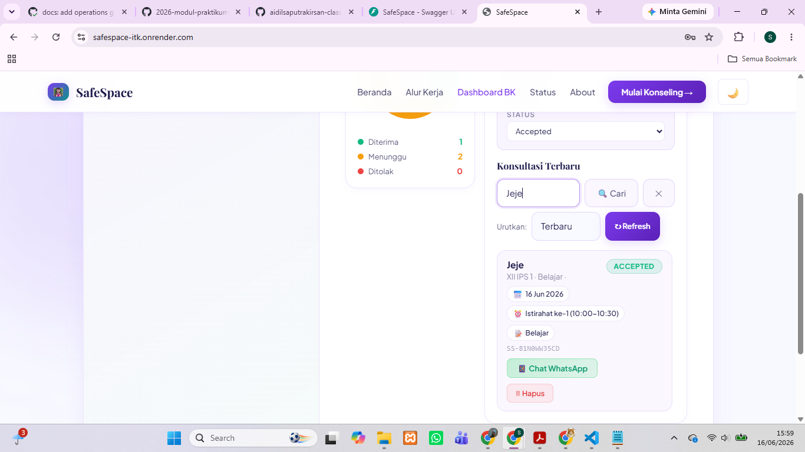
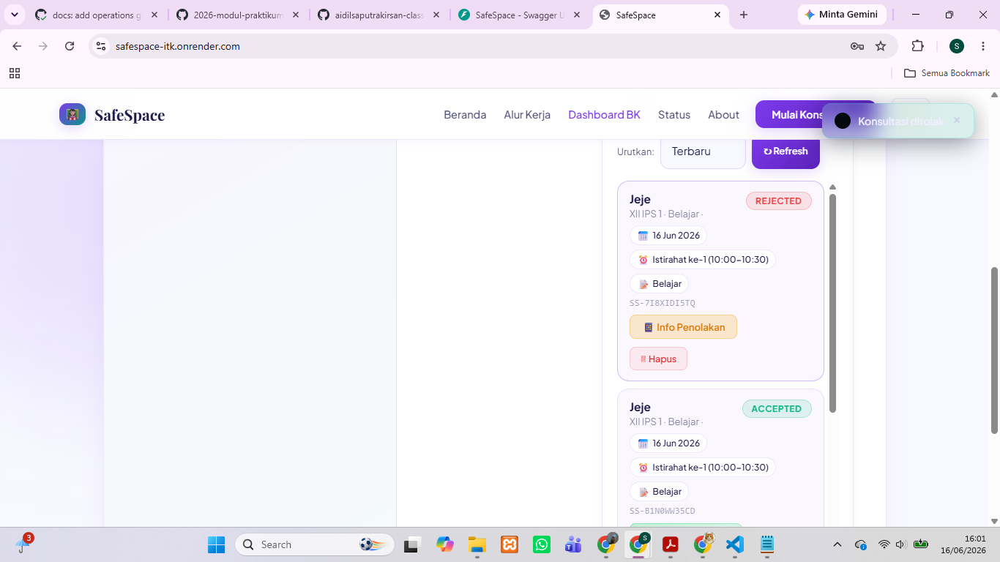
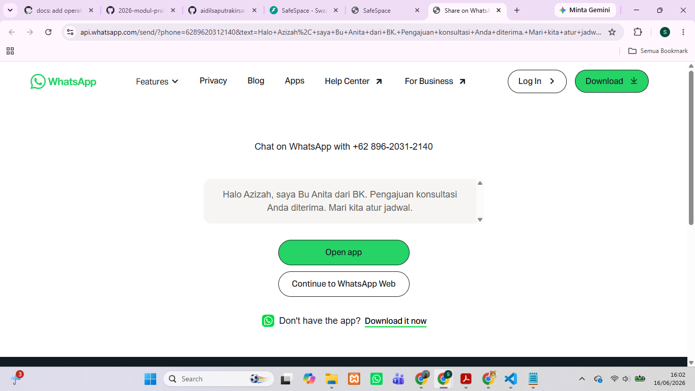
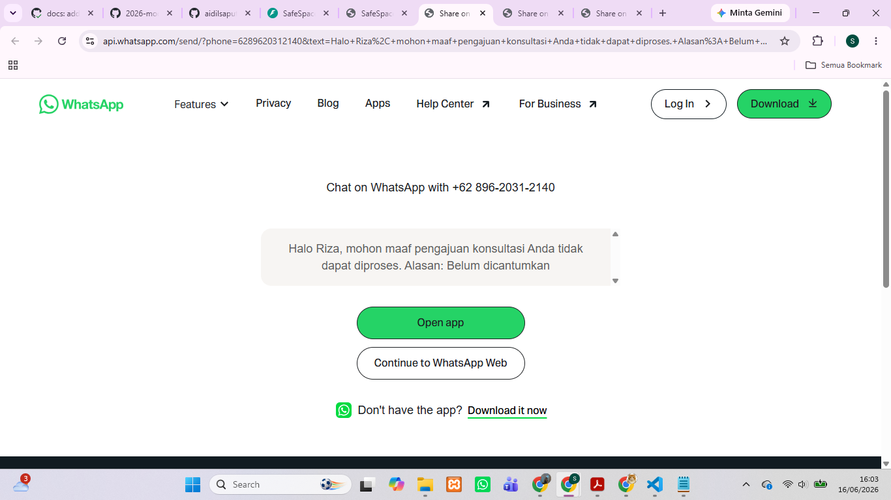
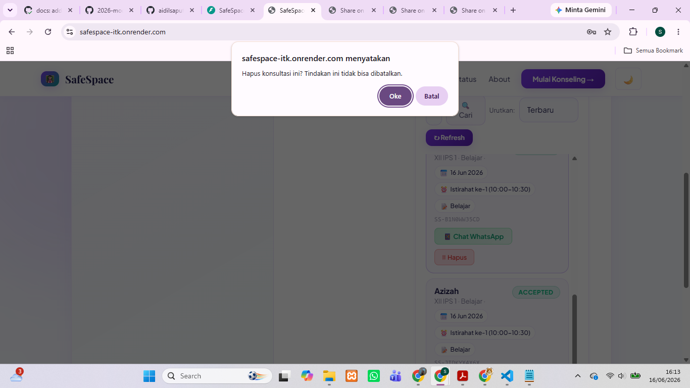
---

### 5. Isolasi Data Antar Guru

| ID | Skenario | Langkah | Expected Result | Status |
|----|----------|--------|----------------|--------|
| BB-23 | Data antar guru | Login akun berbeda | Tidak bisa lihat data guru lain | ✅ Pass |

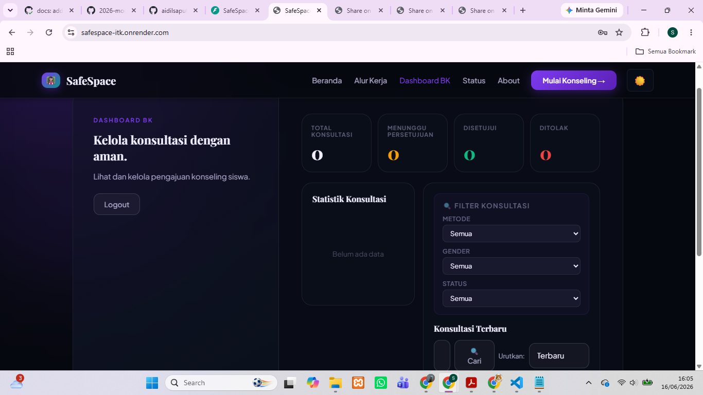
---

## 🔄 C. End-to-End Flow Testing

### Alur lengkap:

1. Siswa isi form
2. Sistem generate tracking code
3. Guru login
4. Guru melihat pengajuan
5. Guru accept/reject
6. WhatsApp terhubung

| Step | Hasil |
|------|------|
| Form submit | ✅ |
| Tracking code | ✅ |
| Dashboard tampil | ✅ |
| Accept/Reject | ✅ |
| WhatsApp redirect | ✅ |

---

## ⚠️ D. Negative Testing

| ID | Skenario | Expected Result | Status |
|----|----------|----------------|--------|
| BB-24 | Input kosong | Error validasi | ✅ Pass |
| BB-25 | Format salah | Error muncul | ✅ Pass |
| BB-26 | Akses tanpa login (dashboard) | Ditolak | ✅ Pass |

---

## 📊 Kesimpulan

Berdasarkan hasil pengujian:

- Semua fitur utama berjalan dengan baik
- Validasi input berfungsi dengan benar
- Alur sistem end-to-end berjalan lancar
- Tidak ditemukan bug kritikal

✅ Aplikasi SafeSpace dinyatakan **berfungsi dengan baik dari sisi user (frontend)**

---

## 📌 Catatan

- Pengujian dilakukan dari sisi user (tanpa melihat kode)
- Fokus pada pengalaman pengguna (UX)
- Semua skenario berhasil dijalankan tanpa error besar