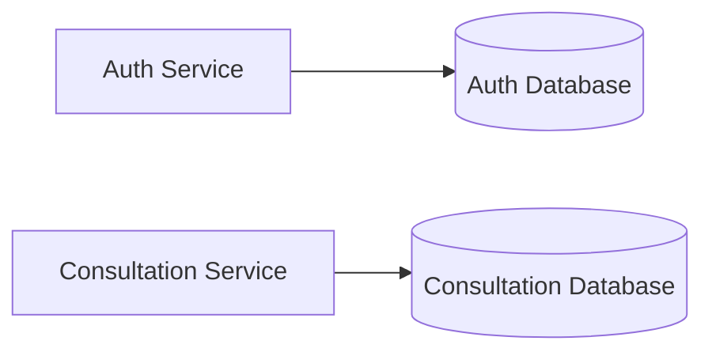
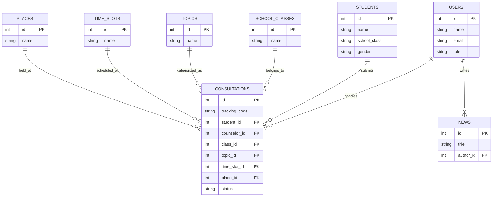

# Database Schema
---
## Overview

SafeSpace menerapkan prinsip **Database per Service** pada arsitektur microservices. Setiap service memiliki database tersendiri sehingga data dapat dikelola secara independen, mengurangi coupling antar service, serta meningkatkan skalabilitas dan maintainability sistem.

Database pada SafeSpace dibagi menjadi dua bagian utama:

| Database              | Service                | Purpose                                                              |
| --------------------- | ---------------------- | -------------------------------------------------------------------- |
| Auth Database         | Authentication Service | Menyimpan data akun Guru BK dan administrator                        |
| Consultation Database | Consultation Service   | Menyimpan data konsultasi, siswa, master data, dan artikel informasi |

---

## Database Architecture

---

## Entity Relationship Diagram (ERD)

---

# Authentication Database

Authentication Database digunakan oleh Authentication Service untuk mengelola akun Guru BK dan administrator.

## users

| Column          | Type        | Description                       |
| --------------- | ----------- | --------------------------------- |
| id              | Integer     | Primary key                       |
| name            | String(100) | Nama pengguna                     |
| email           | String(255) | Email unik pengguna               |
| hashed_password | String(255) | Password yang telah di-hash       |
| role            | Enum        | Role pengguna (COUNSELOR / ADMIN) |
| phone           | String(20)  | Nomor telepon                     |
| photo           | String(255) | Foto profil                       |
| specialization  | String(120) | Bidang spesialisasi konselor      |
| is_active       | Boolean     | Status akun                       |
| created_at      | DateTime    | Waktu pembuatan akun              |
| updated_at      | DateTime    | Waktu pembaruan akun              |

---

# Consultation Database

Consultation Database digunakan untuk menyimpan seluruh data konsultasi dan master data aplikasi.

## students

| Column       | Type        | Description       |
| ------------ | ----------- | ----------------- |
| id           | Integer     | Primary key       |
| name         | String(100) | Nama siswa        |
| school_class | String(64)  | Kelas siswa       |
| gender       | Enum        | Jenis kelamin     |
| phone        | String(20)  | Nomor telepon     |
| created_at   | DateTime    | Waktu pendaftaran |

---

## consultations

| Column        | Type       | Description                    |
| ------------- | ---------- | ------------------------------ |
| id            | Integer    | Primary key                    |
| tracking_code | String(20) | Kode pelacakan konsultasi      |
| student_id    | Integer    | Relasi ke tabel students       |
| counselor_id  | Integer    | Relasi ke tabel users          |
| class_id      | Integer    | Relasi ke tabel school_classes |
| method        | Enum       | Metode konsultasi              |
| topic_id      | Integer    | Relasi ke tabel topics         |
| date          | Date       | Tanggal konsultasi             |
| time_slot_id  | Integer    | Relasi ke tabel time_slots     |
| place_id      | Integer    | Relasi ke tabel places         |
| status        | Enum       | Status konsultasi              |
| notes         | Text       | Catatan tambahan               |
| accepted_at   | DateTime   | Waktu diterima                 |
| rejected_at   | DateTime   | Waktu ditolak                  |
| completed_at  | DateTime   | Waktu selesai                  |
| created_at    | DateTime   | Waktu pembuatan                |
| updated_at    | DateTime   | Waktu pembaruan                |

---

## school_classes

| Column | Type       | Description  |
| ------ | ---------- | ------------ |
| id     | Integer    | Primary key  |
| name   | String(64) | Nama kelas   |
| active | Boolean    | Status aktif |

---

## topics

| Column | Type        | Description           |
| ------ | ----------- | --------------------- |
| id     | Integer     | Primary key           |
| name   | String(100) | Nama topik konsultasi |
| icon   | String(50)  | Ikon topik            |
| color  | String(20)  | Warna topik           |
| active | Boolean     | Status aktif          |

---

## time_slots

| Column     | Type        | Description     |
| ---------- | ----------- | --------------- |
| id         | Integer     | Primary key     |
| name       | String(100) | Nama slot waktu |
| start_time | String(10)  | Jam mulai       |
| end_time   | String(10)  | Jam selesai     |
| active     | Boolean     | Status aktif    |

---

## places

| Column | Type        | Description       |
| ------ | ----------- | ----------------- |
| id     | Integer     | Primary key       |
| name   | String(100) | Lokasi konsultasi |
| active | Boolean     | Status aktif      |

---

## news

| Column       | Type        | Description      |
| ------------ | ----------- | ---------------- |
| id           | Integer     | Primary key      |
| title        | String(200) | Judul artikel    |
| slug         | String(220) | URL slug artikel |
| content      | Text        | Isi artikel      |
| image        | String(255) | Gambar artikel   |
| author_id    | Integer     | Penulis artikel  |
| author_name  | String(100) | Nama penulis     |
| published    | Boolean     | Status publikasi |
| published_at | DateTime    | Waktu publikasi  |
| created_at   | DateTime    | Waktu pembuatan  |
| updated_at   | DateTime    | Waktu pembaruan  |

---

## Relationships

| Parent Table   | Child Table   | Relationship |
| -------------- | ------------- | ------------ |
| users          | consultations | One-to-Many  |
| students       | consultations | One-to-Many  |
| school_classes | consultations | One-to-Many  |
| topics         | consultations | One-to-Many  |
| time_slots     | consultations | One-to-Many  |
| places         | consultations | One-to-Many  |
| users          | news          | One-to-Many  |

---

## Database Design Decisions

Beberapa keputusan desain database yang diterapkan pada SafeSpace:

1. Menggunakan PostgreSQL sebagai relational database management system.
2. Menerapkan prinsip Database per Service untuk mendukung arsitektur microservices.
3. Menggunakan foreign key untuk menjaga integritas data antar tabel.
4. Menggunakan enum pada atribut tertentu untuk menjaga konsistensi nilai data.
5. Menggunakan timestamp (`created_at` dan `updated_at`) untuk kebutuhan audit dan monitoring data.
6. Menggunakan tracking code unik pada tabel consultations untuk mempermudah pelacakan konsultasi oleh siswa.
7. Memisahkan data master (topics, places, school_classes, time_slots) agar lebih mudah dikelola dan dikembangkan.