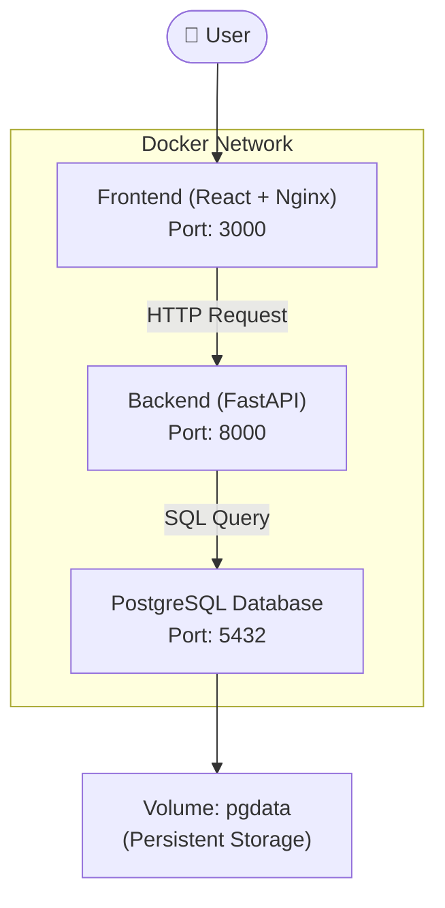

# 🐳 Docker Architecture – SafeSpace Application

Dokumen ini menjelaskan arsitektur deployment aplikasi **SafeSpace** menggunakan Docker dengan pendekatan **multi-container**.

---

## 📦 Arsitektur Sistem

## 🧩 Komponen Container

### 1️⃣ Frontend Container
- **Teknologi:** React + Nginx  
- **Port:** `3000 (host) → 80 (container)`  
- **Fungsi:**
  - Menyediakan antarmuka pengguna (UI)
  - Mengirim request ke backend melalui REST API

---

### 2️⃣ Backend Container
- **Teknologi:** FastAPI (Python)  
- **Port:** `8000 (host) → 8000 (container)`  
- **Fungsi:**
  - Mengelola business logic
  - Menyediakan REST API
  - Menghubungkan frontend dengan database

---

### 3️⃣ Database Container
- **Teknologi:** PostgreSQL  
- **Port:** `5433 (host) → 5432 (container)`  
- **Fungsi:**
  - Menyimpan data aplikasi (user & items)
  - Mendukung persistence menggunakan Docker volume

---

## 🌐 Docker Network

- **Nama network:** `cloudnet`  
- **Fungsi:**
  - Menghubungkan antar container (frontend, backend, database)
  - Memungkinkan komunikasi internal tanpa menggunakan `localhost`

### 🔗 Contoh koneksi:
Backend → Database:

DATABASE_URL=postgresql://postgres:postgres123@db:5432/cloudapp

> 📝 `db` adalah nama container database yang digunakan sebagai hostname.

---

## 💾 Docker Volume

- **Nama volume:** `pgdata`  
- **Path dalam container:**

/var/lib/postgresql/data

### Fungsi:
- Menyimpan data database secara permanen  
- Data tetap ada meskipun container dihapus atau restart  

---

## ⚙️ Environment Variables

Beberapa environment variables penting:

# Database
DATABASE_URL=postgresql://postgres:postgres123@db:5432/cloudapp

# JWT Authentication
SECRET_KEY=your-secret-key
ALGORITHM=HS256
ACCESS_TOKEN_EXPIRE_MINUTES=60

# CORS
ALLOWED_ORIGINS=http://localhost:3000,http://localhost:5173

---

## 🔄 Alur Komunikasi

1. User mengakses aplikasi melalui browser di http://localhost:3000  
2. Frontend mengirim request ke backend (http://localhost:8000)  
3. Backend memproses request dan berinteraksi dengan database  
4. Database mengembalikan data ke backend  
5. Backend mengirim response ke frontend  
6. Frontend menampilkan data ke user  

---

## 📊 Ringkasan Port Mapping

| Service   | Host Port | Container Port |
|----------|----------|----------------|
| Frontend | 3000     | 80             |
| Backend  | 8000     | 8000           |
| Database | 5433     | 5432           |

---

## ✅ Kesimpulan

Arsitektur ini menggunakan pendekatan **multi-container Docker** dengan pemisahan tanggung jawab:

- Frontend → UI & interaksi user  
- Backend → API & business logic  
- Database → penyimpanan data  

Dengan penggunaan:

- **Docker Network** → komunikasi antar container  
- **Docker Volume** → persistence data  

Sehingga aplikasi menjadi lebih **modular, scalable, dan mudah di-deploy**.