# 🔍 Swagger API Testing

Dokumen ini berisi hasil pengujian endpoint API menggunakan Swagger UI pada aplikasi SafeSpace. Pengujian dilakukan untuk memastikan seluruh endpoint dapat diakses dan berjalan sesuai fungsinya.

---

# 📍 Testing Information

| Item | Value |
|--------|--------|
| Application | SafeSpace |
| Testing Type | API Testing |
| Tool | Swagger UI |
| API Documentation | https://safespace-db.onrender.com/docs |
| Tester | Tim Suksesss |
| Environment | Production (Render) |

---

# 🎯 Testing Objectives

Pengujian dilakukan untuk:

- Memastikan endpoint API dapat diakses dengan baik.
- Memvalidasi request dan response API.
- Menguji proses autentikasi menggunakan JWT.
- Memastikan integrasi frontend dan backend berjalan sesuai kebutuhan.
- Memastikan endpoint protected hanya dapat diakses oleh pengguna yang terautentikasi.

---

# 🛠️ Testing Procedure

## 1. Open Swagger UI

Buka dokumentasi API melalui browser:

```text
https://safespace-db.onrender.com/docs
```

Pastikan seluruh endpoint berhasil dimuat pada halaman Swagger UI.

---

## 2. Register Counselor Account

Lakukan registrasi akun Guru BK melalui endpoint berikut:

```http
POST /auth/counselors/register
```

Contoh Request Body:

```json
{
  "name": "Testing Counselor",
  "email": "testing@example.com",
  "password": "Password123"
}
```

Expected Result:

- Status Code: 201 Created
- Data counselor berhasil tersimpan.

📸 Screenshot:
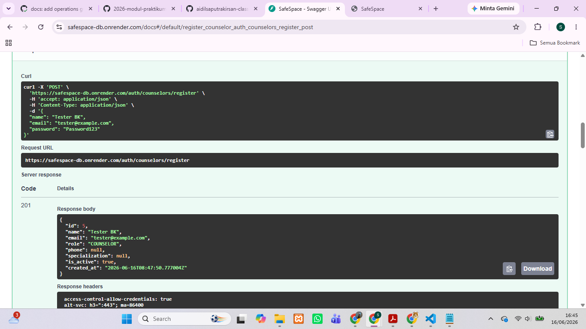

---

## 3. Login & Generate JWT Token

Login menggunakan akun yang telah dibuat:

```http
POST /auth/counselor/token
```

Contoh Request:

```text
username=testing@example.com
password=Password123
```

Expected Result:

```json
{
  "access_token": "...",
  "token_type": "bearer"
}
```

- Status Code: 200 OK
- JWT Token berhasil dibuat.

📸 Screenshot:
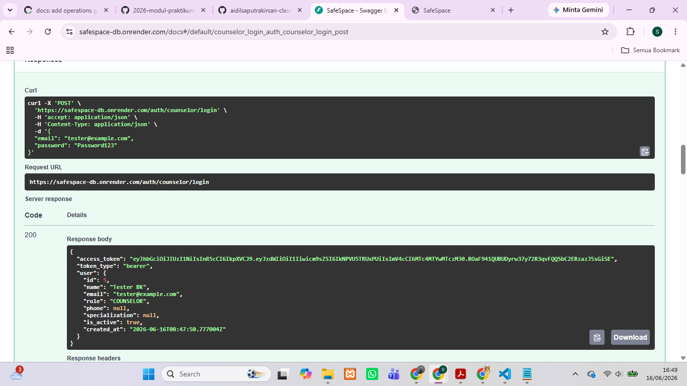

---

## 4. Authorize Swagger

Klik tombol **Authorize** pada Swagger UI.

Masukkan token dengan format:

```text
Bearer <access_token>
```

Kemudian klik:

```text
Authorize → Close
```

Expected Result:

- Endpoint protected dapat diakses.
- Ikon gembok berubah menjadi authorized.

📸 Screenshot:
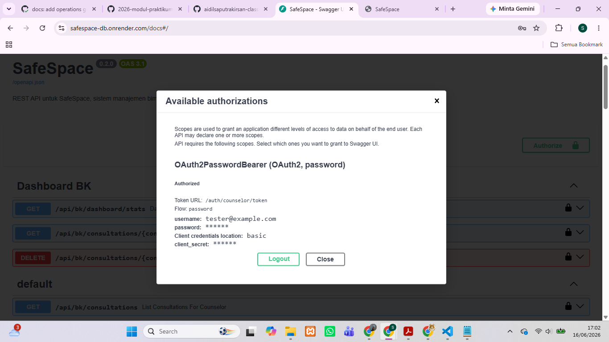

---

# 🔐 Authentication API Testing

| Method | Endpoint | Expected Result | Status |
|----------|----------|----------|----------|
| POST | /auth/counselors/register | Register counselor berhasil | ✅ Pass |
| POST | /auth/counselor/login | Login berhasil | ✅ Pass |
| POST | /auth/counselor/token | JWT token berhasil dibuat | ✅ Pass |
| GET | /auth/me | Data user aktif tampil | ✅ Pass |
| GET | /auth/counselor/me | Data counselor aktif tampil | ✅ Pass |

📸 Screenshot:
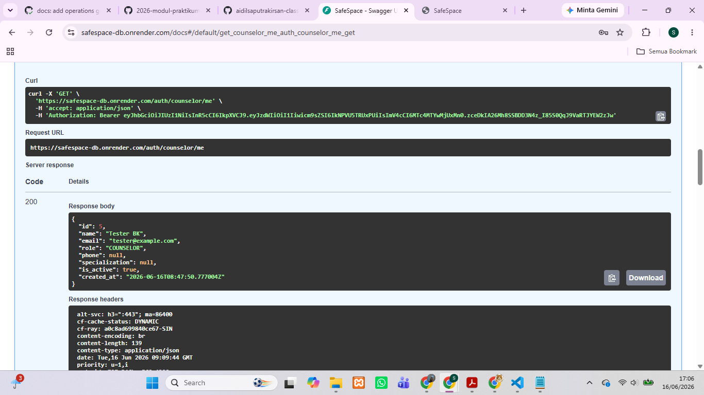

---

# 📝 Consultation API Testing

| Method | Endpoint | Expected Result | Status |
|----------|----------|----------|----------|
| POST | /api/consultations | Konsultasi berhasil dibuat | ✅ Pass |
| GET | /api/bk/consultations | Data konsultasi tampil | ✅ Pass |
| GET | /api/bk/consultations/{id} | Detail konsultasi tampil | ✅ Pass |
| PATCH | /api/bk/consultations/{id}/accept | Status berubah menjadi Accepted | ✅ Pass |
| PATCH | /api/bk/consultations/{id}/reject | Status berubah menjadi Rejected | ✅ Pass |
| DELETE | /api/bk/consultations/{id} | Data berhasil dihapus | ✅ Pass |

📸 Screenshot:
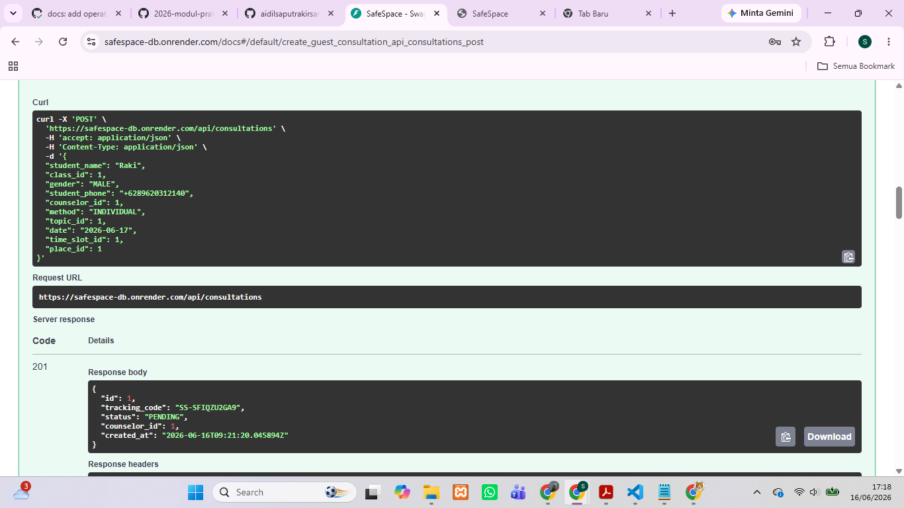
📸 Screenshot:
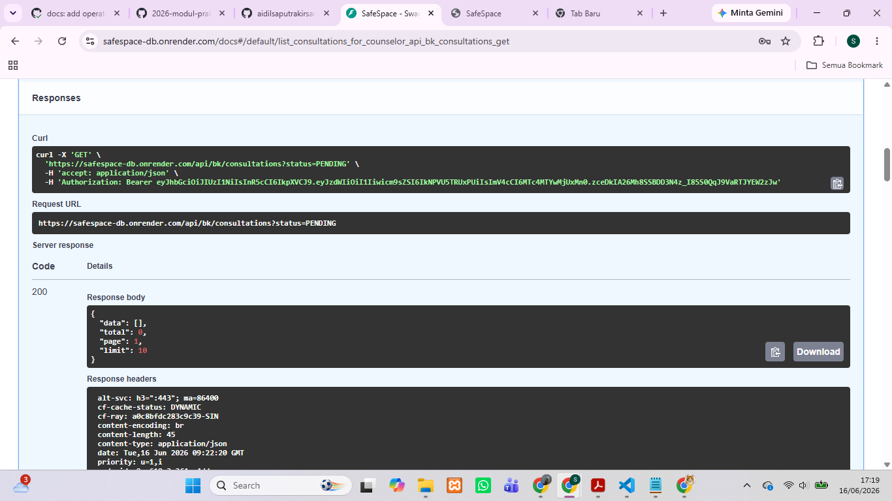
📸 Screenshot:
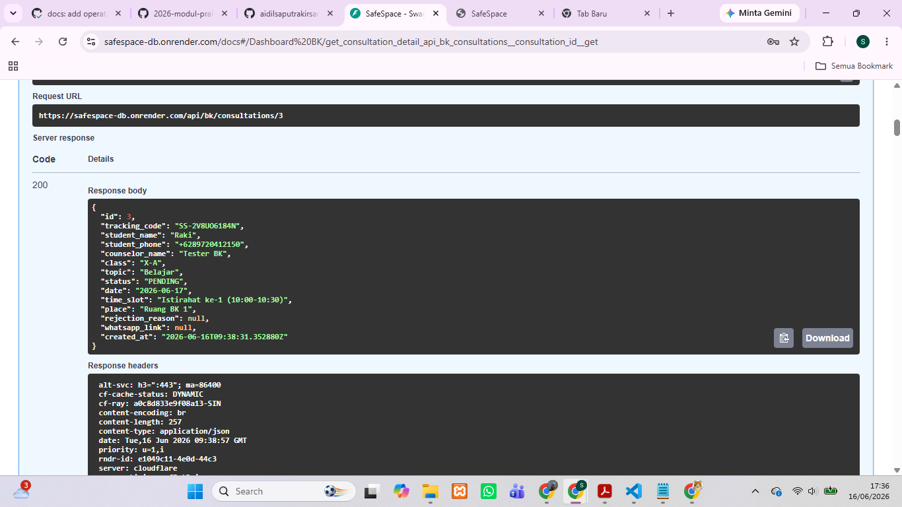
📸 Screenshot:
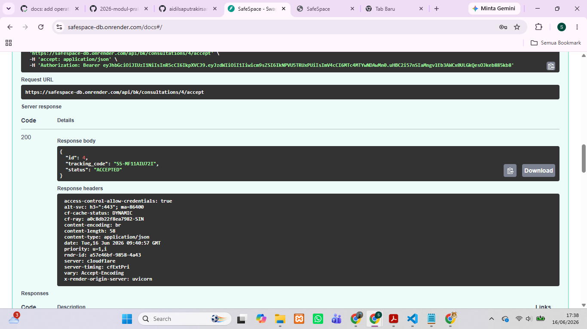
📸 Screenshot:
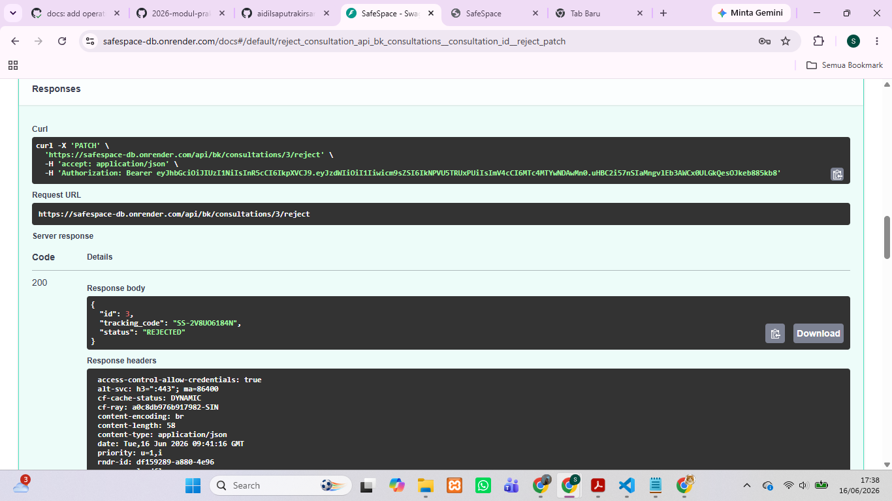
📸 Screenshot:
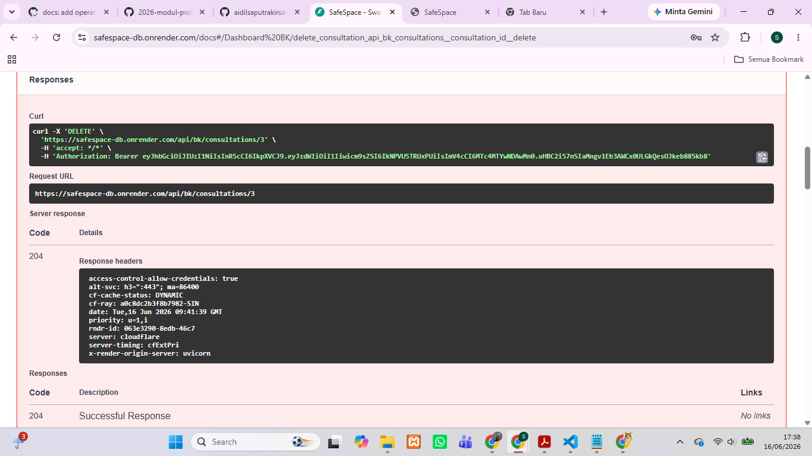

---

# 📊 Dashboard API Testing

| Method | Endpoint | Expected Result | Status |
|----------|----------|----------|----------|
| GET | /api/bk/dashboard/stats | Statistik dashboard tampil | ✅ Pass |

📸 Screenshot:


---

# 🌐 Public API Testing

| Method | Endpoint | Expected Result | Status |
|----------|----------|----------|----------|
| GET | /api/public/master-data | Data master berhasil ditampilkan | ✅ Pass |
| GET | /api/public/counselors | Daftar counselor tampil | ✅ Pass |

📸 Screenshot:
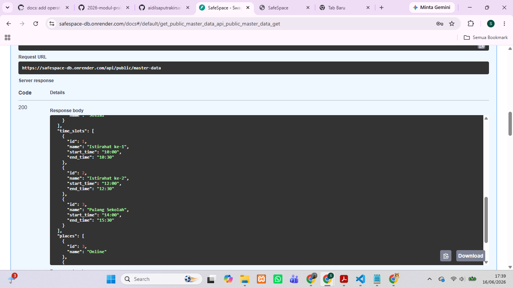
📸 Screenshot:
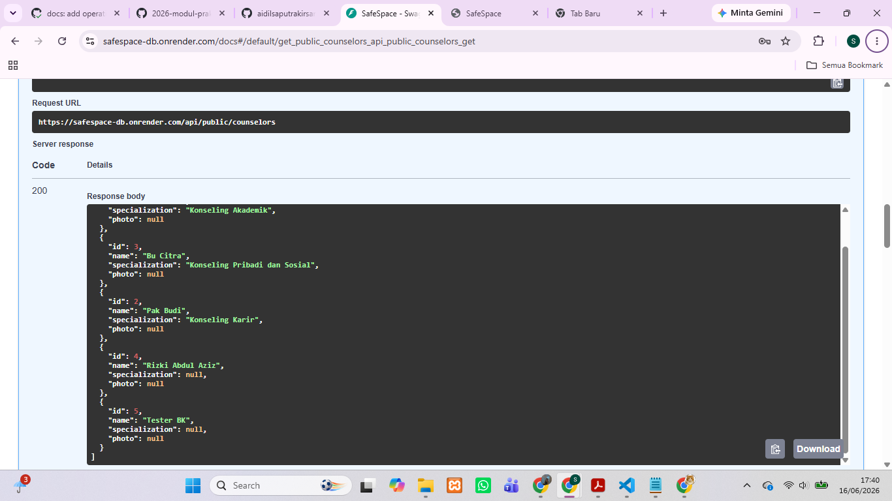

---

# 📈 Monitoring API Testing

| Method | Endpoint | Expected Result | Status |
|----------|----------|----------|----------|
| GET | /health | Service berstatus healthy | ✅ Pass |
| GET | /monitoring/health | Monitoring service aktif | ✅ Pass |
| GET | /monitoring/error-rate | Data error rate tampil | ✅ Pass |
| GET | /team | Informasi tim tampil | ✅ Pass |

📸 Screenshot:
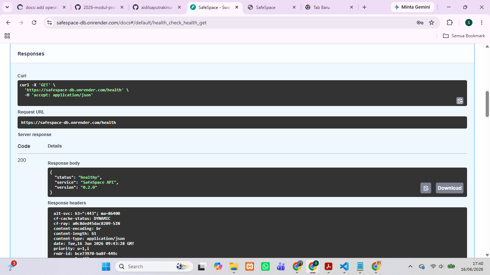
📸 Screenshot:
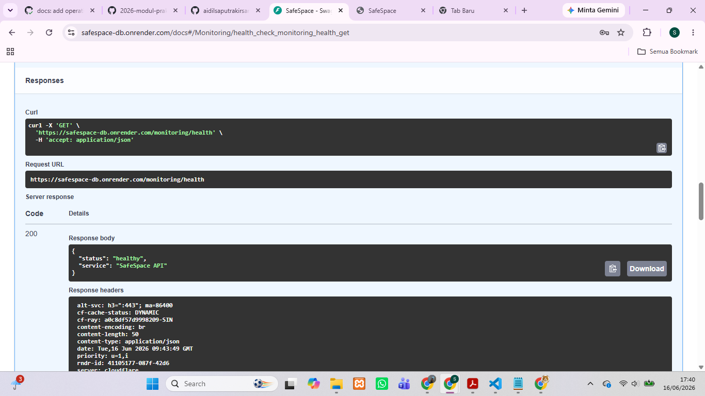
📸 Screenshot:
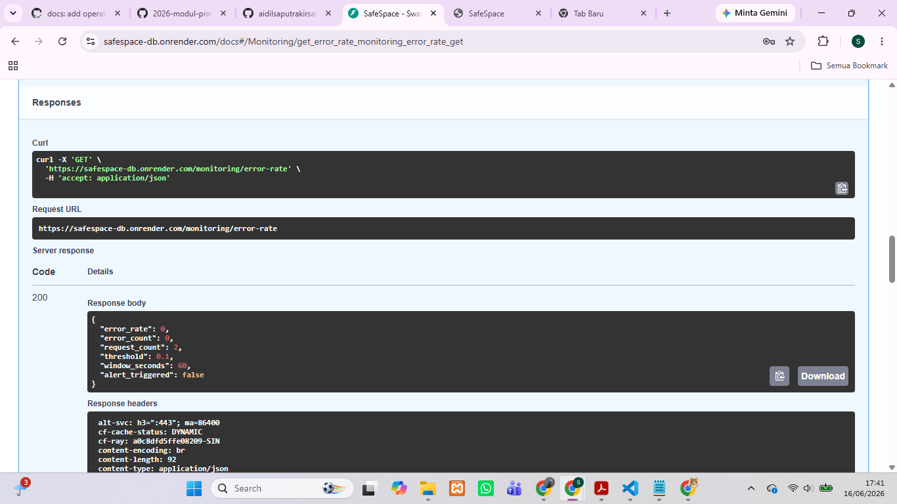
📸 Screenshot:
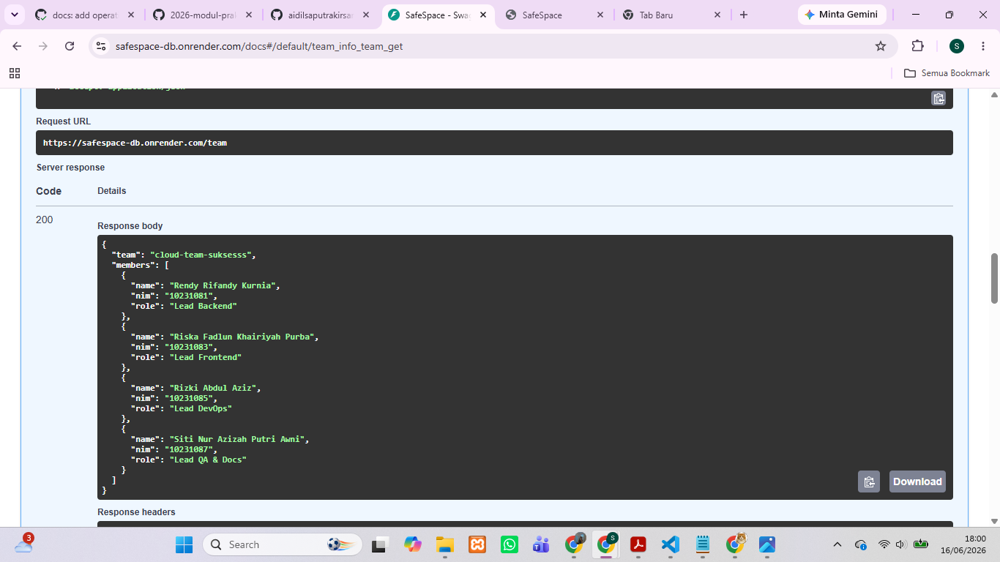

---

# 📋 Testing Summary

| Category | Total Endpoint | Result |
|-----------|-----------|-----------|
| Authentication API | 5 | ✅ Pass |
| Consultation API | 6 | ✅ Pass |
| Dashboard API | 1 | ✅ Pass |
| Public API | 2 | ✅ Pass |
| Monitoring API | 4 | ✅ Pass |
| **Total** | **18 Endpoint** | ✅ **Pass** |

---

# ✅ Conclusion

Berdasarkan hasil pengujian menggunakan Swagger UI, seluruh endpoint pada aplikasi SafeSpace berhasil dijalankan sesuai fungsinya. Proses autentikasi, pengelolaan konsultasi, dashboard, layanan publik, serta monitoring berjalan dengan baik dan menghasilkan response yang sesuai dengan spesifikasi sistem.