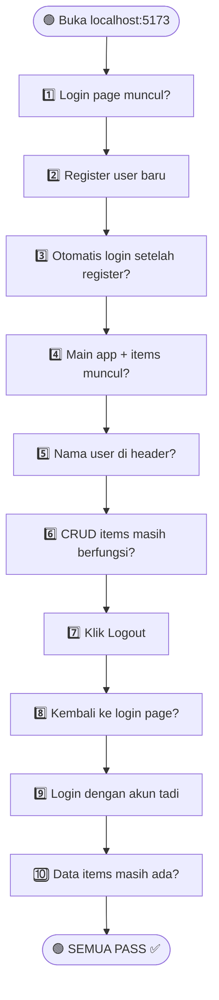

# 🧪 UI Testing Results - Week 4
SafeSpace Cloud App

**Tester:** Siti Nur Azizah (Lead QA & Docs)  
**Module:** Authentication & Item Management  
**Environment:** Local Development (localhost)  
**Frontend:** http://localhost:5173  
**Backend API:** http://localhost:8000  

---

## 📋 Deskripsi Pengujian

Pengujian dilakukan untuk memastikan seluruh alur aplikasi berjalan dengan baik setelah implementasi fitur **Authentication (Register, Login, Logout)** dan integrasi dengan fitur **CRUD Items**.

Testing mencakup:
- Alur autentikasi user
- Integrasi frontend dan backend
- Persistensi data setelah login ulang
- Validasi fungsi CRUD setelah autentikasi

---

## 🔄 Testing Flow



---

## ✅ Test Case Results

| No | Test Case | Expected Result | Actual Result | Status |
|----|-----------|-----------------|---------------|--------|
| 1 | Login page tampil | Halaman login muncul saat membuka aplikasi | Sesuai | ✅ PASS |
| 2 | Register user | User baru berhasil dibuat | Sesuai | ✅ PASS |
| 3 | Auto login | Sistem otomatis login setelah register | Sesuai | ✅ PASS |
| 4 | Main app tampil | Dashboard dan items muncul | Sesuai | ✅ PASS |
| 5 | Nama user tampil | Header menampilkan nama user login | Sesuai | ✅ PASS |
| 6 | CRUD items | Create, Edit, Delete berjalan normal | Sesuai | ✅ PASS |
| 7 | Logout | User keluar dari sistem | Sesuai | ✅ PASS |
| 8 | Redirect login | Aplikasi kembali ke login page | Sesuai | ✅ PASS |
| 9 | Login ulang | User dapat login kembali | Sesuai | ✅ PASS |
|10 | Data persist | Data items tetap tersimpan | Sesuai | ✅ PASS |

---

## 📸 Screenshot Hasil Testing

Screenshot disimpan pada folder:

```
docs/images/
```

### 1. Login Page


### 2. Register Success


### 3. Dashboard Setelah Login


### 4. CRUD Item Berhasil


### 5. Logout Berhasil


### 5. Login Kembali 


---

## 🟢 Hasil Pengujian

Seluruh fitur utama aplikasi berhasil berjalan dengan baik:

- Authentication system berfungsi dengan benar
- Integrasi Frontend dan Backend berhasil
- CRUD Items tetap stabil setelah implementasi auth
- Session management berjalan normal
- Data tersimpan dengan baik setelah login ulang

---

## 🐞 Bug Report

Tidak ditemukan bug selama proses pengujian.

---

## ✅ Kesimpulan

Berdasarkan hasil pengujian, aplikasi **SafeSpace** telah berhasil melewati seluruh skenario testing pada Week 4.

Seluruh alur utama sistem berjalan stabil dan siap untuk tahap pengembangan selanjutnya.
